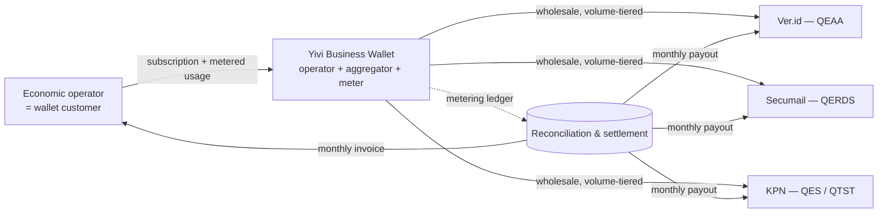

# Ecosystem & Business Model — Yivi as Business Wallet operator, QTSPs as volume providers

**Status:** strategy / proposal. Non-binding. Illustrative numbers only — not pricing.
**Regulation:** COM(2025) 838 Art 4 (legal equivalence), Art 5(1)(d)(e)(i), Art 7(3)/11(3) (QTSP fast-track), Art 8 (QEAA), Art 16; eIDAS (EU 910/2014) Art 3, 5(1)(d), 5(1)(e), 5(1)(i), 43–44.
**Source refs:** `regulation/FEATURE_LIST.md` (§"Parties we would need"), `regulation/COM_2025_838_act.md`, `.ai/features/qerds.md`, `.ai/features/attestations.md`, `.ai/features/oid4vci-over-qerds.md`.

---

## 1. What this is

A commercial model for a European Business Wallet (EBW) that **Yivi owns and operates** as a
platform, while the **qualified trust services** the wallet depends on are supplied by
independent **Qualified Trust Service Providers (QTSPs)** plugged in behind config-swappable
seams. Yivi is the **wallet operator and aggregator**, not a QTSP for these services.

The regulation is explicit that the EBW "does not prescribe a single rigid business model … but
rather sets a framework that combines interoperability with flexibility, fostering competition
and innovation" (`COM_2025_838_act.md`). This doc picks one model inside that space: **a
volume-metered marketplace** where the wallet is the demand aggregator and QTSPs compete to
supply units of qualified service.

### The three anchor providers (illustrative, all NL-qualified today)

| Provider | Trust service supplied | eIDAS / EBW hook | Unit of value |
|---|---|---|---|
| **Ver.id** | **QEAA** — Qualified Electronic Attestation of Attributes | Art 8 (QEAA issuer must be a QTSP); eIDAS 2.0 Annex V | one attestation issued (+ optional renewal / revocation) |
| **Secumail** | **QERDS** — Qualified Electronic Registered Delivery Service | Art 5(1)(i), Art 16; eIDAS Art 43–44 | one registered message + its delivery evidence bundle |
| **KPN** | **QES** — Qualified Electronic Signature, and/or **QTST** — Qualified Electronic TimeStamp | Art 5(1)(d) / 5(1)(e) | one signing operation; one qualified timestamp |

Ver.id, Secumail and KPN are named as concrete, swappable examples — the model treats each as
one *instance* of a role. Any provider on the EU Trusted List for that service can occupy the
same slot; the wallet negotiates against several per role to keep the market competitive (see
`FEATURE_LIST.md` for the current NL-qualified lists behind QERDS, QTST and qualified certificates).

---

## 2. The seam this reuses

Every one of these services is the **same architectural seam** the codebase already uses for
auth and QERDS: a thin typed client to an external qualified service, behind a provider
interface chosen by config, correlated by the provider's own token.

```
auth (OpenID4VP): backend ──requestor──▶ hosted EUDI verifier     (trust service)
QERDS:            backend ──client─────▶ Secumail / Aangetekend    (qualified TSP)
QEAA issuance:    backend ──client─────▶ Ver.id                    (qualified TSP)
QES / QTST:       backend ──client─────▶ KPN                       (qualified TSP)
```

The commercial consequence of that seam is the whole business model: because each provider sits
behind an interface and is **selected per transaction**, the operator can (a) meter every call at
the seam, (b) route by price/SLA, and (c) multi-source a role. The interface that keeps us free
of vendor lock-in (Annex §1(2): open, royalty-free standards, mandatory interoperability) is the
same interface that makes a volume market possible.



---

## 3. Who Yivi is in this model

Yivi plays **three stacked roles**, and the money follows the roles:

1. **Wallet operator** — runs the EBW product (the software in this repo), the owner dashboard,
   the transaction log (Art 5(1)(m)), export/portability, per-org theming, membership & authz.
   Monetised as a **platform subscription** (per wallet / per seat / per org).
2. **Trust-service aggregator** — holds the commercial relationships with the QTSPs, negotiates
   **wholesale volume tiers** on behalf of the entire installed base, and routes each transaction
   to a provider. Monetised as the **spread** between wholesale and retail unit prices.
3. **Metering & settlement operator** — the transaction log doubles as the billing meter; it
   reconciles metered usage against provider statements and bills customers / pays providers.
   Monetised as the reliability of that ledger (and optionally a small settlement fee).

Yivi is deliberately **not** the QTSP for QEAA/QERDS/QES/QTST. Holding qualified status for four
service types means four conformity-assessment audits (ETSI EN 319 401 + service-specific),
four supervisory relationships and four liability regimes. The aggregator role captures margin
**without** taking on that regulatory surface — the QTSP remains the qualified party of record
and carries the eIDAS liability for its own service (Art 44 evidence, Art 8 attribute accuracy).

---

## 4. The volume-based model

### 4.1 Units of value (what gets metered)

Everything billable is a **discrete, countable qualified transaction** captured at the provider
seam and written to the metering ledger:

| Service | Metered unit(s) |
|---|---|
| QEAA (Ver.id) | attestation **issued**; attestation **renewed**; attestation **revoked/suspended** (often free); status-check (usually free/flat) |
| QERDS (Secumail) | registered message **sent**; message **received/inbound**; each **evidence bundle** retained; **long-term retention** per item-year |
| QES (KPN) | one **signing operation** (per signature, or per document); certificate provisioning where short-lived |
| QTST (KPN) | one **qualified timestamp** issued |

Design rule, inherited from `qerds.md`: **the evidence is the product, not a side-effect.** The
delivery-evidence bundle, the signature, the timestamp token — these immutable artefacts are the
billable unit *and* the legal artefact. The Art 5(1)(m) transaction log is therefore the single
source of truth for both audit and billing; it must be append-only and reconcilable (same
posture as `internal/audit`, different purpose).

### 4.2 Price mechanics — wholesale ↓ / retail ↑ with a volume-decaying spread

Two prices exist for every unit:

- **Wholesale unit price** `w(v)` — what Yivi pays the QTSP, **decreasing** with aggregate volume
  `v` across the whole installed base. This is the aggregator's core leverage: one 5-million-item
  QERDS contract negotiated centrally beats every tenant negotiating alone.
- **Retail unit price** `r(v)` — what the customer pays, also **tiered down** with the customer's
  own volume so large customers still get a better deal.

Operator margin per unit = `r(v_customer) − w(v_total)`. Because wholesale keys on **aggregate**
volume and retail keys on **per-customer** volume, the spread is naturally positive and *widens*
as the platform grows even while both prices fall — the flywheel: more wallets → more aggregate
volume → cheaper wholesale → more competitive retail → more wallets.

### 4.3 Customer-facing packaging (hybrid, not pure per-transaction)

Pure metered pricing is unpredictable for a business buyer, so bill as **base + metered overage**:

- **Platform subscription** (fixed): the wallet, dashboard, transaction log, export, support.
  Covers operator role #1 regardless of trust-service usage.
- **Included allowances** per tier: e.g. *N* QERDS sends, *M* signatures, *K* attestations bundled.
- **Metered overage**: usage beyond the allowance at the tier's `r(v)`, itemised by service.
- **Retention / storage** (recurring): QERDS evidence and signed-document preservation billed
  per item-year — turns a one-time send into an annuity (LTA under ETSI EN 319 522 / 319 421).

Illustrative tier sketch (numbers are placeholders, **not** a price list):

| Tier | Monthly base | Included | Overage — QEAA / QERDS / QES / QTST |
|---|---|---|---|
| Starter | € low | small allowances | high per-unit |
| Growth | € mid | mid allowances | mid per-unit |
| Enterprise | negotiated | committed volume | lowest per-unit, custom SLA |

### 4.4 Settlement flows (who is merchant of record)

Two options; the model defaults to **(A)** and keeps (B) for regulated-liability-sensitive cases:

- **(A) Reseller / wholesale.** Yivi is merchant of record to the customer, buys units wholesale,
  resells at retail, keeps the spread. Simplest customer experience (one invoice), strongest
  aggregation leverage. Yivi carries contractual (not eIDAS-qualified) obligations for
  availability/routing; the QTSP still carries the eIDAS liability for the qualified act itself.
- **(B) Referral / revenue-share.** The QTSP is merchant of record for its own qualified service
  and bills the customer directly; Yivi takes a **platform rake** (% or per-transaction fee) for
  origination + orchestration. Cleaner liability separation, weaker aggregation leverage, more
  invoices for the customer.

### 4.5 Indicative unit prices (market-anchored)

These are **real market data points** from public trust-service price lists (mid-2026), used to
size the model. They are *ranges*, not quotes — every real number is volume-, contract- and
country-specific. Sources are listed at the bottom of this doc.

| Service (unit) | Market **retail today** | **High-volume floor** | What drives the price |
|---|---|---|---|
| **QTST** — one qualified timestamp | €0.02–€0.05 / stamp | **€0.015** / stamp (1M pack) | pure compute; near-zero marginal cost, all volume curve |
| **QERDS** — one registered message + evidence | ~€2.63 / msg at 1k/yr | €0.50–€1.50 / msg at volume | evidence generation + retention; benchmark = €5–€10 physical registered post |
| **QES** — one qualified signature | €3–€6 / signature (pay-as-you-go, identity-verified) | €0.20–€2 / signature at volume or with a local cert | the **identity proofing per signing** dominates, not the crypto |
| **QEAA** — one attestation issued | no public market yet (new) | proxy €0.50–€5 / issuance | = IDV/KYC cost when it bundles verification; status-check & revocation usually **free** |

Reading the table:

- **QTST is almost free and pure volume-curve.** €0.048 at 5k stamps → €0.015 at 1M (a >3×
  drop). This is the clearest case for the aggregator: buy in million-stamp packs centrally,
  resell fractions of a cent of margin per stamp across the whole base.
- **QERDS is anchored to physical registered post.** At €2.63/message for 1,000/year it already
  undercuts the €5–€10 paper equivalent; at enterprise volume providers reach €0.50–€1.50. The
  recurring **evidence-retention** line (per item-year) sits *on top* of the send price.
- **QES cost is identity, not signature.** The €3–€6 pay-as-you-go price is mostly the
  per-signing identity verification; a **certificate-based** model (verify once, sign many)
  collapses the marginal signature toward the €0.20–€2 floor. Which model the wallet routes to is
  a real margin lever.
- **QEAA has no settled market**, so it is priced by proxy against identity-verification/KYC APIs
  (€0.33–€3.50 per verification; database-only checks €0.50–€1.50). A QEAA that re-seals an
  already-verified attribute trends to the low end; one that includes fresh IDV trends to the high
  end. Revocation and status checks are typically zero-priced — the meter must not bill them.

**How Yivi prices on top.** Yivi buys at (or near) the high-volume floor by aggregating the whole
base, then sells at a retail unit price that still beats what a single customer could negotiate
alone, keeping the spread. As a rule of thumb, model the platform margin as **~15–40 % over
wholesale** on metered units (thinner on near-commodity QTST, fatter on QES/QEAA where
orchestration and routing add real value), folded into the tier's included allowances + overage
rather than shown as a separate line.

**Worked example — one mid-size customer, annual.** Illustrative volumes at mid-range retail:

| Service | Volume / yr | Indicative retail | Line total |
|---|---|---|---|
| QERDS sends | 5,000 | €1.20 / msg | €6,000 |
| QES signatures | 2,000 | €3.50 / sig | €7,000 |
| QEAA issued | 500 | €2.00 / att | €1,000 |
| QTST stamps | 20,000 | €0.03 / stamp | €600 |
| **Metered subtotal** | | | **≈ €14,600** |
| Platform subscription (Growth tier) | | fixed | + base fee |

So a single mid-size wallet is a **~€15k/year** metered account before the platform subscription,
of which Yivi keeps the wholesale→retail spread (order-of-magnitude a few thousand € of gross
margin per account like this) plus the full subscription. The model scales on **account count ×
per-account volume**, which is exactly what the aggregation flywheel (§4.2) compounds.

> ⚠️ Every euro figure here is an **indicative planning number**, not an offer, a quote, or a
> committed price. Trust-service pricing is negotiated per contract, per volume and per country;
> treat these as the shape of the curve, not the price.

---

## 5. Why each provider says yes

The model is only stable if it's positive-sum for the QTSPs:

- **Distribution.** The wallet is a demand funnel. A QTSP reaches every EBW customer through one
  integration instead of one sales cycle per enterprise.
- **Utilisation.** Qualified infrastructure has high fixed cost and low marginal cost; aggregated
  wallet volume fills capacity, so lower wholesale unit prices still improve provider contribution.
- **Fast-track alignment.** QTSPs already get a fast-track onto the EBW provider list
  (Art 7(3), 11(3)); being *inside* an operating wallet is a natural extension of that status.
- **No disintermediation.** Yivi does not seek qualified status for their service, so it is a
  channel, not a competitor. The QTSP keeps the qualified relationship and the regulated liability.

---

## 6. Channel & consortium partners — the distribution side

§4–5 are the **supply side** (QTSPs supplying qualified units) and Yivi as operator/aggregator.
This section is the **distribution side**: how the wallet reaches economic operators, and what is
in it for the consortium partners who help it get there. The key insight: **"reseller" is only one
of four archetypes**, and the deal structure differs per archetype. Naming a municipality a
"reseller" or a certification body a "channel" would misprice the relationship.

> The four organisations below are characterised from general knowledge of the Dutch market; treat
> the archetype mapping as a starting point to correct, not a fixed fact about each party.

| Partner (example) | Archetype | What they bring | What's in it for them | How value flows |
|---|---|---|---|---|
| **PinkRoccade Local Government** | **Reseller / ISV channel** | installed base of ~all NL municipalities + their business-facing back-office | channel margin, ARR uplift, differentiation, no build cost | partner discount + volume rev-share + services margin |
| **Gemeente Nijmegen** | **Public-sector customer & authentic-source issuer** | B2G demand, authentic-source data, a reference deployment | regulatory compliance, lower cost-to-serve, first-mover influence | mostly non-commercial; may issue EAAs |
| **KIWA** | **Attribute / credential issuer** (TIC body) | certifications, accreditations, professional qualifications | digitise a paper product, anti-fraud, recurring verification revenue | issuance/verification fees; a Ver.id-style QEAA slot |
| **Nuts** | **Interop / standards / federation partner** | a sectoral (healthcare) trust network + shared VC/DID stack | reach, standards alignment, no duplicate infra | bridge/gateway; largely non-monetary |

### 6.1 PinkRoccade — the actual reseller (and the model that matters here)

This is the one the question is really about. PinkRoccade already sells the municipal software that
NL local government runs on. The business wallet is an **add-on line item in a contract they already
own** — they don't need a new buying centre, they need a new SKU. What's in it for them, concretely:

- **Channel margin.** They buy the platform subscription at a **partner/wholesale discount** and
  resell at retail to their municipal (and municipal-business) customers — keeping the spread. Same
  reseller/referral split as §4.4: option **(A)** they are merchant of record and bill their
  customer one invoice; option **(B)** referral, and they take a rake.
- **Volume revenue-share.** On top of the subscription, a share of the **metered trust-service
  volume** (§4.5) that flows through their installed base — QERDS sends, signatures, timestamps,
  attestations. As their base's usage grows, so does their recurring cut, with no extra selling.
- **Services margin (often the biggest line).** Integration into their suites, first-line support,
  onboarding, training — billed by them, their margin, not Yivi's. Channel partners frequently make
  more on services than on licence resale.
- **Stickiness & differentiation.** A compliance-ready EBW is a competitive moat in their core
  municipal-software business and raises switching cost — strategic value beyond the direct margin.
- **Zero build cost / de-risked compliance.** They ship an EBW without standing up four QTSP
  integrations, a metering ledger, or the qualified-status surface (§3) themselves.

For Yivi the trade is **reach**: one channel agreement puts the wallet in front of hundreds of
municipalities and their business customers with no direct sales motion. The cost is the channel
discount + rev-share — margin traded for distribution, which is the classic reseller bargain.

**Reseller economics, sketched.** A channel partner with *N* municipal customers, each with *M*
business relationships transacting at the §4.5 worked-example rate (~€15k/yr metered): the partner
earns `channel-discount × subscription × N` + `rev-share × metered-volume × N × M` + services. The
levers are *N* (their reach — already large) and per-account volume (the §4.2 flywheel).

### 6.2 Gemeente Nijmegen — customer + issuer + reference, not reseller

A municipality does not resell; it is on the **demand and issuance** side. Three roles, three
distinct value propositions:

- **Relying party / B2G obligation.** Under the EBW regulation municipalities must **interact with
  business wallets** for public-sector submissions and notifications (the B2G core of
  `FEATURE_LIST.md`). Partnering early means lower cost-to-serve businesses and a wallet shaped
  around their real processes rather than retrofitted.
- **Authentic-source EAA issuer.** A public-sector body can issue **EAAs** (not QEAAs — no QTSP
  status needed, per Art 8) from data it is the authentic source for: permits, licences, local
  registrations, subsidy eligibility. That turns municipal paperwork into verifiable credentials the
  business carries in-wallet — admin-burden reduction on both sides.
- **Reference / co-design launch partner.** Being first buys influence over the roadmap and a
  procurement reference other municipalities follow (and that PinkRoccade can then resell into).

What's in it for them is therefore **compliance + cost reduction + local economic development +
influence**, not a margin. The "payment" is a better, cheaper public-service rail and a seat at the
design table.

### 6.3 KIWA — credential issuer, a new digital product line

A TIC body's product *is* attestation: it certifies that a thing/person/organisation meets a
standard. Today that ships as a PDF or a paper certificate. In this model KIWA becomes an **attribute
issuer** — issuing its certifications as **(Q)EAAs** into business wallets, occupying (or feeding) the
same QEAA slot as Ver.id in §1. What's in it for them:

- **Digitise a paper product** into a tamper-evident, instantly-verifiable credential — a genuinely
  new digital line, not a cost centre.
- **Anti-fraud & instant verification.** Forged/expired certificates become checkable in seconds;
  the relying party verifies against KIWA as issuer.
- **Recurring verification revenue.** Issuance is one event; **verification is ongoing** — a natural
  metered, recurring line (whoever relies on the certificate pays to trust it).
- **Optionality on qualification.** KIWA can issue plain EAAs directly, or partner with a QTSP (or
  qualify itself) to issue **QEAAs** for the higher legal tier — the wallet's QEAA seam (§2) takes
  either without changing the wallet.

Here value can flow **both ways**: KIWA may pay per issuance (like buying QEAA units from a QTSP)
while charging *its own* customers for digital certificates + verification — so it is both a cost and
a revenue centre, netting positive on the new product.

### 6.4 Nuts — interop / standards partner, not a channel

Nuts runs a sectoral (healthcare) decentralised-trust network on overlapping VC/DID/OpenID4VC
technology. It is not a reseller and not a customer — it is a **federation/interop partner**. The
value is mutual reach without duplicate infrastructure:

- **Bridge, don't rebuild.** A gateway between the Nuts care network and the EBW lets care
  organisations use the business wallet as their credential holder, and lets EBW-issued attestations
  be consumed inside Nuts — neither side rebuilds the other's rails.
- **Standards alignment.** Shared SD-JWT VC / OpenID4VP / DID choices (the same stack this repo's
  auth and attestations already use) keep the two ecosystems interoperable by construction —
  exactly the Annex §1(2) open-standard mandate.
- **Governance seat.** Influence over how sector-specific trust maps onto the EBW; for Yivi, a
  proven interop story into a regulated vertical.

Compensation is mostly **non-monetary** (reach, standards, avoided duplication); if money moves it is
a bridging/gateway arrangement, not a resale margin.

### 6.5 The one-paragraph consortium logic

Put together: **PinkRoccade distributes** (channel margin + rev-share + services), **Nijmegen anchors
demand and issues authentic-source EAAs** (compliance + cost + influence), **KIWA supplies
credentials as a new digital product** (issuance + recurring verification), and **Nuts keeps it
interoperable with the healthcare vertical** (standards + reach). Yivi operates the wallet and the
meter in the middle (§3). Each partner is paid in the currency it actually values — margin,
compliance, product revenue, or reach — which is why the consortium holds together instead of every
party wanting the same slice.

---

## 7. What has to be true in the code (implications, not commitments)

The business model imposes concrete platform requirements — most already match the existing
seam-based design:

1. **Provider interface per role** — QEAA-issuer, QERDS, QES, QTST each a config-swappable client
   interface (as `qerds.md` already does for QERDS). Multi-sourcing a role means the interface
   must support *selection*, not just a single configured provider.
2. **A metering ledger** that is append-only, reconcilable against provider statements, and
   derived from — or identical to — the Art 5(1)(m) transaction log. This is the billing seam;
   it must not be an ops log that can be rewritten.
3. **Routing policy** — per-transaction provider choice by price/SLA/tenant preference, isolated
   from call sites so pricing changes don't touch handlers.
4. **Retention accounting** — evidence/signed-document preservation metered per item-year, since
   it is recurring revenue and a legal-durability requirement at once.
5. **Partner attribution** — the meter must tag each transaction with the originating channel
   partner (§6) so rev-share and channel-discount settlement is derivable from the same ledger,
   not a spreadsheet on the side.
6. **Interoperability discipline** — open, royalty-free standards and mandatory interop
   (Annex §1(2)) are what keep a role multi-sourceable and a Nuts-style bridge possible; a provider
   integration that leaks proprietary assumptions into the wallet breaks both the law and the
   market leverage.

None of §7 is a build commitment — it is the shape the platform must hold for §4 and §6 to be real.
Today only the QERDS seam exists (stub provider, `qerds.md`); QEAA/QES/QTST seams are future work.

---

## 8. Open questions

- **Merchant-of-record default** — reseller (A) vs referral (B) has tax, liability and
  invoicing-experience consequences; likely per-service, not one global choice.
- **Channel vs direct conflict** — if PinkRoccade resells into a municipality that Yivi could also
  reach directly, the channel agreement must define territory / deal-registration to avoid channel
  conflict.
- **Cross-border pricing** — QTSPs are nationally qualified but the EBW is EU-wide; a role may
  need a different provider per member state, complicating aggregate-volume leverage.
- **Free-tier units** — status checks, revocations and inbound QERDS receipts are often
  zero-priced by providers; the meter must distinguish billable from free units.
- **Bundling vs unbundling** — whether customers can bring their own QTSP for a role (portability)
  or must use the wallet's negotiated provider (leverage). Annex §1(2) leans toward allowing BYO.

---

## Sources for §4.5 indicative prices

Public price lists / analyses consulted mid-2026 (retrieved for planning; verify before quoting):

- **QTST** — qtsa.eu qualified-timestamp packs: €240/5k (€0.048) → €15,000/1M (€0.015). Datasure
  QTST €49/mo consumption tier. <https://qtsa.eu/purchase/>, <https://www.datasure.net/en/our-services/eidas-qualified-electronic-timestamp/prices-qualified-electronic-timestamp/>
- **QERDS** — SecuMailer qualified registered email (~€2,625 / 1,000 msgs ≈ €2.63/msg). Physical
  registered-post benchmark €5–€10. <https://secumailer.com/qualified-registered-email/>
- **QES** — ZealiD pay-per-signature €4; itsme/Evrotrust €3.71–€4.95; DocuSeal $0.2 (local cert)
  / $2.0 (provider). <https://www.zealid.com/en/pricing>, <https://www.e-signature.eu/en/qes-electronic-signature-without-subscription-vs-docusign-and-adobe-sign/>, <https://www.docuseal.com/faq/what-are-the-costs-for-qes-and-aes>
- **QEAA proxy (IDV/KYC)** — Didit $0.33/check; Microblink from $0.50; standard doc+AML $1.50–$3.50;
  database-only $0.50–$1.50. <https://didit.me/pricing/>, <https://fintechspecs.com/blog/kyc-cost-per-verification-pricing-benchmarks/>, <https://www.complycube.com/en/a-guide-to-kyc-api-pricing/>
