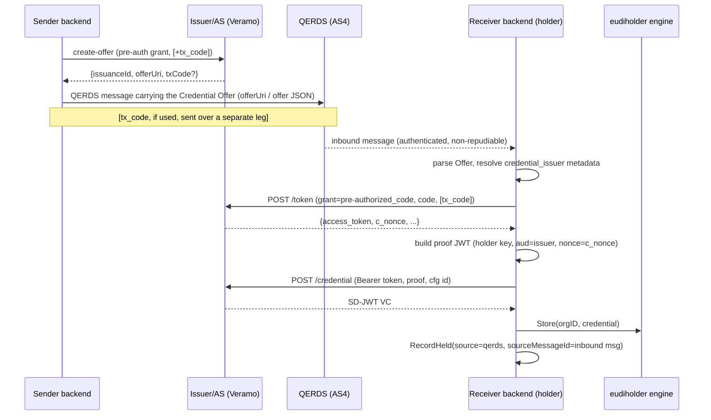
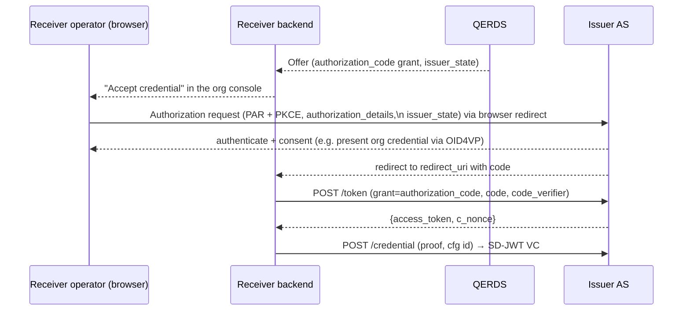

# OpenID4VCI issuance between business wallets over a secure channel (QERDS)

Status: **design** (not yet built). Grounds the receive/hold work described in
[`attestations.md`](./attestations.md) §9.5 (`source=qerds`) and the QERDS
transport in [`qerds.md`](./qerds.md). Companion to the in-flight change that
replaces the proprietary QERDS "claim-link notification" with a real OpenID4VCI
Credential Offer.

## 1. Purpose & scope

An organization (the **sender**) wants to issue an attestation (EAA) to another
organization (the **receiver**) so it lands in the receiver's business wallet
automatically, without a human copy-pasting a claim link. Both parties are
**backend services**, not phones, and they already share an authenticated,
non-repudiable channel: **QERDS** (qualified electronic registered delivery,
AS4/eDelivery).

This doc describes how the two OpenID4VCI grant types —
**pre-authorized code** and **authorization code** — map onto that setup, what
each requires, and which one fits a headless business wallet. It is
transport-and-role focused; the credential *format* (SD-JWT VC) and the holder
storage engine (`eudiholder`, irmago per-org Postgres schema) are unchanged.

### Why not just push the raw VC over QERDS?

Because "offer, then fetch" is the interoperable model and it keeps the
security properties where they belong:

- The **holder key binding** and **issuer trust chain** are established at the
  credential endpoint, by the receiver's own wallet — not implied by who sent a
  blob. Pushing a raw SD-JWT VC over QERDS would bind the credential to whatever
  key the *sender* chose, defeating holder binding.
- A Credential Offer is small, standard, and replay-bounded (short-lived
  pre-auth code). The receiver pulls the credential itself, so its wallet gets a
  fresh `c_nonce` and proves possession of its own key.

QERDS's job is therefore to deliver **the Offer**, authenticated and
non-repudiably, not the credential.

## 2. Actor mapping

| OpenID4VCI role | Who, in this system |
|---|---|
| Credential Issuer + Authorization Server | The **sender org's** issuer. Today this is the **hosted Veramo issuer** (`internal/openid4vciissuer`, `ATTESTATION_ISSUER=veramo`) which runs the token + credential endpoints; our backend only calls `create-offer`. |
| Credential Offer endpoint / delivery | **QERDS** (`internal/qerds` + `qerdsprovider`) instead of a QR code. |
| Wallet / Holder | The **receiver org's** business wallet: a new OpenID4VCI *holder* client driving irmago's `eudi/openid4vci` flow, storing into the per-org `eudiholder` engine and indexing via `attestation.RecordHeld` (`source=qerds`). |

The key asymmetry vs. a phone wallet: the receiver's wallet reaches the issuer's
HTTPS token/credential endpoints **server-to-server**, and there is no browser /
user-agent in the loop unless we deliberately add one (see Flow B).

## 3. What QERDS gives us, and what OpenID4VCI still must do

QERDS delivery of the Offer establishes, at the transport layer:

- **Authenticated sender identity** — `originalSender` / `finalRecipient`
  eDelivery addresses (`qerdsprovider/domibus.go` message properties).
- **Integrity + confidentiality** — AS4 signing/encryption.
- **Non-repudiation** — the evidence chain (`qerds_evidence`), so the receiver
  can prove which org offered what, and when.

That means the *authorization decision* ("this org may issue to that org") is
carried by the channel. It does **not** replace the OpenID4VCI-level guarantees,
which still happen at fetch time and must not be dropped:

- **Holder key binding** — the receiver's proof JWT at the credential endpoint
  binds the VC to the receiver wallet's key. QERDS does not do this.
- **`c_nonce` / proof-of-possession replay protection** — issued by the token
  (or nonce) endpoint, echoed in the proof JWT.
- **One-time, short-lived pre-auth code** — redemption is idempotent and
  expires; a replayed Offer must not yield a second credential.
- **Issuer trust chain** — when the received SD-JWT VC is validated, the
  receiver checks the issuer against its trusted-issuer set (`EUDI_ISSUER_CHAIN`
  today for the verifier path; the holder needs the equivalent trust list of
  organizations permitted to issue EAAs). **Delivery over a trusted channel is
  not a substitute for issuer-trust validation.**

## 4. Flow A — Pre-authorized code over QERDS (recommended)

The natural fit. The sender has *already decided* to issue (that is the whole
point of sending), so there is nothing to authorize interactively at fetch time.
This is exactly the grant `openid4vciissuer.CreateOffer` already requests
(`client.go:85`, `grants[urn:…:pre-authorized_code].pre-authorized_code`).



### The Credential Offer object

Standard OpenID4VCI. What Veramo returns as `offerUri` is the wallet deeplink
(`openid-credential-offer://?credential_offer=…` by value, or
`?credential_offer_uri=…` by reference) encoding:

```jsonc
{
  "credential_issuer": "https://veramo-issuer.…/<instance>",
  "credential_configuration_ids": ["<cfg id>"],
  "grants": {
    "urn:ietf:params:oauth:grant-type:pre-authorized_code": {
      "pre-authorized_code": "<opaque, one-time>",
      "tx_code": { "input_mode": "numeric", "length": 4 }   // optional
    }
  }
}
```

Over QERDS we transmit **this object** (or the `offerUri` that resolves to it),
not our `/claim/<token>` link.

### Redemption (receiver side)

1. **Resolve issuer metadata**: `GET {credential_issuer}/.well-known/openid-credential-issuer`
   and the AS metadata; discover `token_endpoint`, `credential_endpoint`,
   `nonce_endpoint` (if present).
2. **Token**: `POST token_endpoint`
   `grant_type=urn:ietf:params:oauth:grant-type:pre-authorized_code`,
   `pre-authorized_code=<code>`, and `tx_code=<code>` iff the Offer required one.
   → `access_token`, `c_nonce`.
3. **Proof**: build an `openid4vci-proof+jwt` signed by the receiver wallet's
   holder-binding key: `aud=credential_issuer`, `iat`, `nonce=c_nonce`, key in
   `jwk`/`kid`.
4. **Credential**: `POST credential_endpoint` with the Bearer token, the proof,
   and the credential configuration id → the SD-JWT VC (possibly `deferred`).
5. **Validate + store**: verify the issuer trust chain and binding, then
   `eudiholder.Holder.Store` + `attestation.RecordHeld(source=qerds,
   sourceMessageId=<inbound qerds_messages.id>)`.

irmago's `eudi/openid4vci` holder implements steps 1–4; the receive glue wires
it to the inbound QERDS message and the `eudiholder`/held-index write.

### tx_code over a secure channel

`tx_code` is a second factor binding redemption to something only the intended
receiver holds. Its normal purpose (phone flows) is to stop an intercepted QR
from being redeemed by an attacker. Over QERDS the channel is already
authenticated to the receiver org, so tx_code is **largely redundant** — but it
still adds value as an **operator-binding / dual-control** factor if you want the
redeeming automation to require a code an admin distributes out-of-band. If used,
it MUST travel on a **different leg** than the Offer (e.g. email/console to a
human), never in the same QERDS body — co-locating them defeats the purpose.
Default recommendation: **omit tx_code for machine-to-machine QERDS issuance;
rely on the channel + short code lifetime + one-time redemption.**

### Failure & lifecycle

- **Expiry**: the pre-auth code is short-lived; a late redemption fails at the
  token endpoint → mark the inbound message needs-action, do not silently drop.
- **Replay / idempotency**: inbound dedupe is on `(direction, provider_ref)`
  (`message_store.go`); redemption must additionally be idempotent per
  `issuanceId` so a re-delivered Offer never mints a second held credential.
- **Deferred issuance**: if the issuer returns `deferred`, poll the deferred
  endpoint; keep the inbound message in a pending state until resolved.

## 5. Flow B — Authorization code over QERDS (when interaction is required)

Use this only when the issuer must **interactively authenticate or get consent
from the holder** at fetch time — e.g. the receiver must present its own
credential (OID4VP) to the sender's AS before issuance, apply per-request policy,
or choose among dynamic parameters. For a plain "org A issues to org B" over an
already-trusted channel, this is **overkill**; prefer Flow A.

The Offer instead carries:

```jsonc
"grants": {
  "authorization_code": {
    "issuer_state": "<opaque, links back to this offer>",
    "authorization_server": "https://…"        // optional, if multiple AS
  }
}
```

The friction for a **headless business wallet** is the redirect-based OAuth: the
authorization endpoint expects a user-agent and a `redirect_uri`. Two viable
shapes:



1. **Console-mediated (interactive)**: the receiver org's admin console acts as
   the user-agent. An operator clicks *Accept*; the browser performs the
   authorization-code dance (PAR + PKCE, `authorization_details` of type
   `openid_credential`, `issuer_state` from the Offer). The `redirect_uri` is a
   backend endpoint on the receiver that finishes token + credential. Requires
   the sender's AS to be able to authenticate the receiver's operator —
   cross-org identity, plausibly via the operator presenting an EUDI credential
   (OID4VP) at the AS.
2. **Fully automated auth-code** is generally *not* worth it: without a human or
   a delegated-authorization primitive there is nothing for the AS to
   authenticate that pre-auth doesn't already cover.

**Dependencies**: the hosted Veramo issuer must expose the authorization
endpoints and accept an `authorization_code` grant in `create-offer` (today
`client.go` only requests the pre-auth grant). Until then, Flow B is
forward-looking.

## 6. Recommendation

- **Default to Flow A (pre-authorized code)** for all business-wallet-to-wallet
  issuance over QERDS. It is server-to-server, needs no browser, and the secure
  channel already carries the authorization decision.
- **Reserve Flow B (authorization code)** for issuance that must authenticate or
  get consent from the receiver at fetch time; treat it as a later extension
  gated on issuer-side auth-endpoint support.
- **Do not push raw VCs** over QERDS — always offer-then-fetch, so holder binding
  and issuer-trust validation stay with the receiver's wallet.
- **Keep tx_code off** for the M2M path by default; if a dual-control factor is
  wanted, deliver it on a separate leg.

## 7. Fit to this codebase (implemented — Flow A)

Flow A (pre-authorized code) is **built**. The offer travels as a structured body
part, not an attachment, so no inbound-attachment plumbing was needed.

**Send**
- `attestation.MarshalCredentialOfferEnvelope` (`offer_envelope.go`) wraps
  `Offer.OfferURI` in a typed JSON body (`type: eaa-credential-offer/v1`).
- `attestation/service.go` `deliver` passes `offer.OfferURI` (not a claim link)
  to the `qerdsNotifier`; `qerdsOfferSender.SendCredentialOffer`
  (`cmd/api/main.go`) serialises the envelope into the QERDS body.
- Org offers are minted **without** a tx_code (`UseTxCode` scoped to the
  external-email path), so the receiver can auto-redeem.

**Receive**
- `qerds.Service` gained an optional `InboundConsumer` seam, invoked on each
  newly-received message (`service.go`).
- `attestation.OfferReceiver` (`offer_receiver.go`) implements it: parse the
  envelope → `eudiholder.Holder.Redeem` → `RecordHeld(source=qerds,
  sourceMessageId=…)`. Idempotent via `Store.HeldForMessage`.
- `eudiholder.Holder.Redeem` runs irmago's `eudi/openid4vci` holder flow
  (`engine_redeem.go`, pre-auth grant, auto-consent, auth-code declined),
  writing straight into the org's per-org storage. `StubHolder.Redeem`
  synthesises a held credential so the receive loop runs offline (default).

**Holder trust posture** (`eudiholder.RedeemConfig`, config `ATTESTATION_HOLDER_*`):
a configured trusted-issuer CA chain (`ATTESTATION_HOLDER_TRUST_CHAIN`, the
holder analogue of `EUDI_ISSUER_CHAIN`), else irmago's built-in trust model, plus
`…_STAGING_ANCHORS` for staging issuers and `…_ALLOW_INSECURE_HTTP` for local dev.

**Known limitations**
- A failed redemption is **logged, not auto-retried**: `CreateInbound` dedupes
  on re-delivery and returns no message, so the consumer only fires on first
  receipt. The QERDS message stays in the inbox for follow-up. A durable retry
  (return the deduped message, or a redemption-state column) is future work.
- **Live validation pending**: the irmago `Engine.Redeem` path compiles and is
  wired, but end-to-end redemption against the hosted Veramo issuer (trust
  anchors, endpoint reachability) has not been exercised headlessly — validate
  against a live issuer before enabling `ATTESTATION_HOLDER=irmago` in an
  environment that receives offers. The stub path is covered by tests.
- Flow B (authorization code) is still design-only (§5).

## 8. Open questions

1. **Offer carriage**: Offer JSON in the QERDS *body* vs. as an *attachment* vs.
   just the `offerUri` string? (Attachment path needs the inbound-attachment
   plumbing fix.) → leaning: the `offerUri` / offer JSON in a structured body
   part with a content-type marker so the receiver can distinguish it from a
   human message.
2. **Auto-accept vs. operator approval** on receive: does an inbound Offer
   redeem automatically, or land in an approval queue in the org console?
   (Policy + `held` state machine implication.)
3. **Issuer reachability**: the receiver must reach the sender's issuer HTTPS
   endpoints directly. Is that always true, or must the *credential* sometimes be
   delivered over QERDS too (deferred/relayed fetch)? If endpoints are not
   reachable, Flow A breaks and a relayed variant is needed.
4. **Trust list source**: where does the receiver's list of trusted issuing orgs
   come from (registry, EUDI trusted list, manual)?
5. **Veramo auth-code support**: needed before Flow B is more than design.
