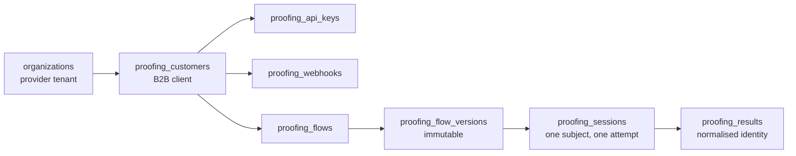
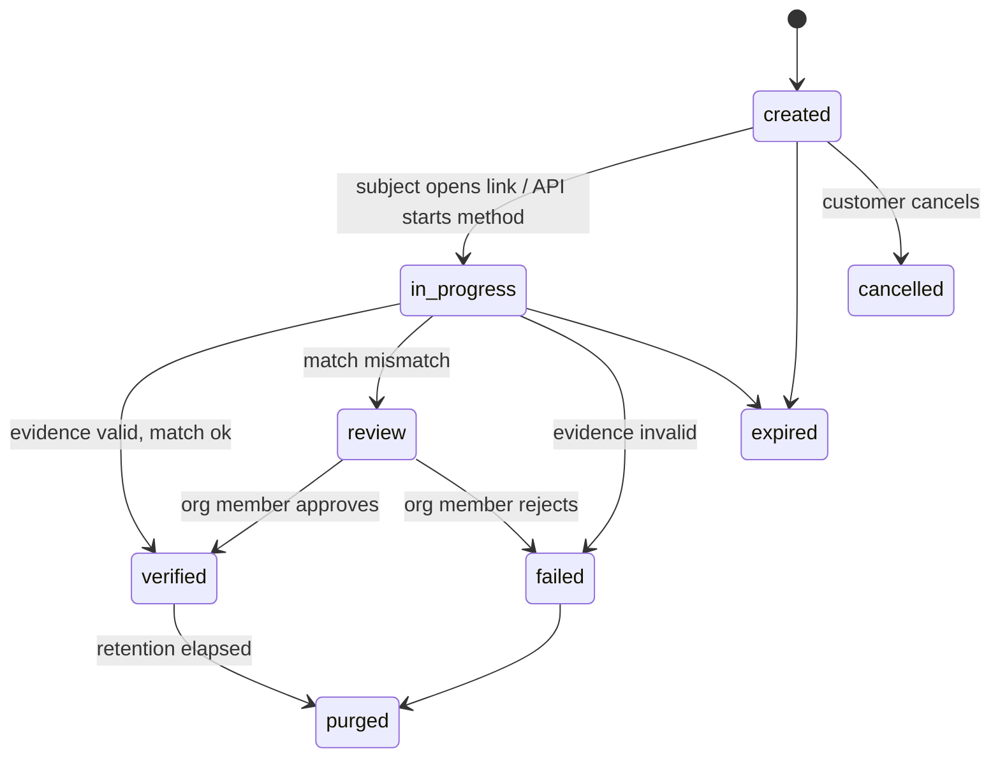
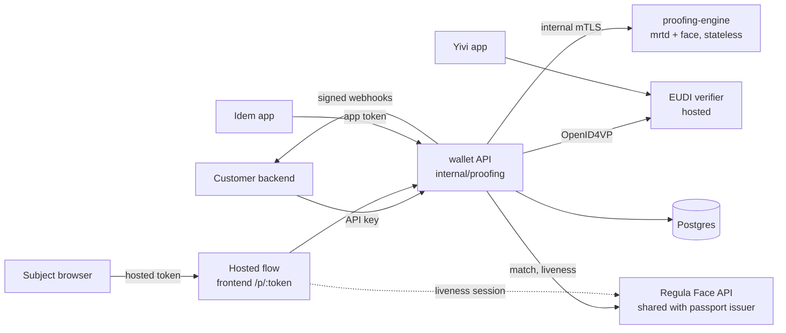
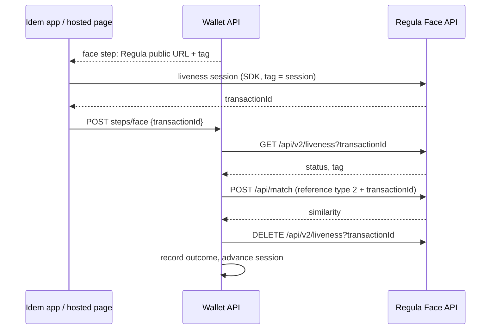
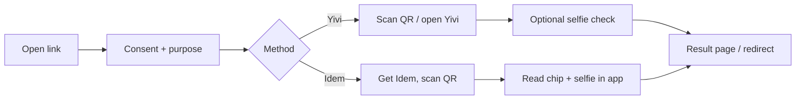
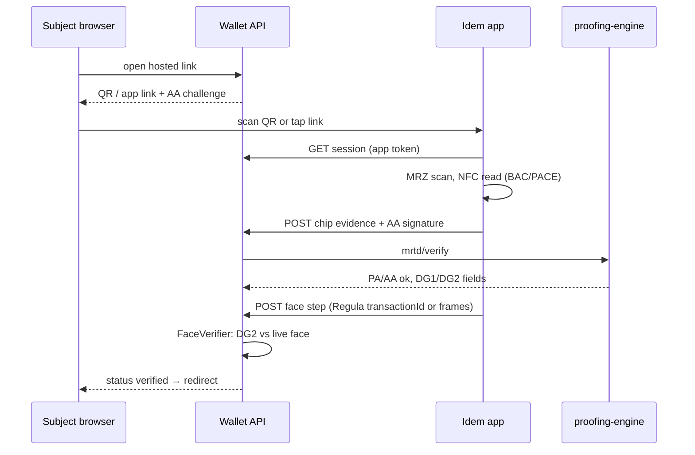

# Identity proofing of external people in the business wallet

Status: **proposed** (design only, not yet implemented). Drafted 2026-09-24.

## Summary

We fold the standalone identity-proofing-service into the business wallet as a new product, **Identity Proofing**. An org, as a tenant, can then verify the identity of **external people** on behalf of its own B2B customers. It reuses the wallet's tenancy, roles, audit log and EUDI verifier integration and does not build parallel versions of them.

### Goals

1. **API-first.** Every capability is available through a versioned public API before any UI is built on it. The hosted flow and the admin UI use that same API.
2. **Multi-level tenancy.** The **org** (a business wallet tenant) is the provider. It creates **customers** (its B2B clients), and each customer gets its own **flows**, API keys, branding and webhooks.
3. **Optional white-labelled hosted flow.** A customer either embeds proofing through the API with its own UI, or sends people to a hosted page in the customer's branding, optionally on the customer's own domain.
4. **Two proofing methods at launch:**
   - **Idem**: our white-label document-reading app. It reads the NFC chip of a passport or ID card.
   - **Yivi**: disclosure of existing identity credentials from the Yivi app, over OpenID4VP.
5. **Wallet-native governance.** Every mutation and every proofing outcome is written to the org's audit log. Org members manage customers and flows under the existing role model.

### Non-goals (this phase)

- Extra data points such as VOG, diploma or KvK extract. The flow model leaves room for them (see Extension points), but none ship now.
- Proofing org **members**. Members keep joining through the invitation lifecycle and the personal Yivi app.
- Issuing new credentials to the proofed person. This is a candidate follow-up.
- Billing and metering beyond usage counters.

## Context

The standalone [identity-proofing-service](https://github.com/privacybydesign/identity-proofing-service) (main at `7bf5bad`, 2026-09-23) has a strong evidence engine but only thin product plumbing. The business wallet is the reverse: the plumbing is mature, and it has no proofing of people who are not members. The integration takes the engine from one and the plumbing from the other.

| Capability | identity-proofing-service today | Business wallet today | In the integrated product |
| --- | --- | --- | --- |
| Tenancy | `tenants` + `sub_tenants`, managed by `adminctl` or an `ADMIN_KEY` API | `organizations`, memberships, invitations, `Authorize` middleware | org = provider, `proofing_customers` = sub-tenant |
| Admin identity | Yivi email login limited to caesar.nl / yivi.app | OpenID4VP login, roles, mandates, platform admins | Wallet |
| API keys | `sk_test_` / `sk_live_`, hashed, scoped | None inbound | Port the IPS model to `proofing_api_keys` |
| Flows | `flow_versions` with steps, thresholds, assurance, activate | None | Port, keyed on customer |
| Sessions and state machine | created → opened → in\_progress → needs\_review → approved/rejected | Public-token pattern (VOG, re-identification, external signees) | Port the IPS machine; hosted access uses the wallet's token pattern |
| NFC chip verification | `mrtdverify`: Passive Authentication against the ICAO CSCA masterlist, Active Authentication over a server challenge, clone and tamper detection | None | Keep, via the engine |
| Face match and liveness | GhostFaceNet match (0.50) and MiniFASNet liveness (0.65), TFLite over cgo | None | Per flow: the built-in engine, or the Regula Face API we already host for go-passport-issuer (see Face providers) |
| Yivi | IRMA requestor disclosure of `pbdf.pbdf.passport` / `idcard`, plus a live face match on the photo | OpenID4VP via the hosted EUDI verifier, `ScopeIdentity` DCQL | Wallet's OpenID4VP path (see Proofing methods) |
| Hosted flow and white-label | Missing: `/api/v1/s/{token}` has no handler, and there is no branding (issue #9) | Themes (`org_theme_settings`), public token pages, `IdentityDisclosure` UI | Build in the wallet |
| Webhooks | HMAC-signed, retry up to 24 h, dead-letter | Transactional outbox for notifications; HMAC inbound for QERDS | Port the IPS semantics onto a wallet outbox |
| Audit | `events` table; photos copied into it | `audit_events` via `Recorder`, per org, transactional | Wallet |
| Manual review | `needs_review` status, no UI | Identity-review queue pattern for platform admins | Build, per org |
| Schema management | `CREATE TABLE IF NOT EXISTS` at startup | goose migrations, `cmd/migrate` | Wallet |

### Gaps we inherit and must close

1. **Chip data is not bound to the claims.** The name, date of birth and reference photo come from the app's JSON. They are not parsed from the verified DG1/DG11/DG2 bytes, so a modified app could pair genuine chip evidence with another name. This is the Idem path only: Idem posts the raw chip bytes (SOD, DGs, AA signature) plus its own parsed JSON, and the server runs Passive and Active Authentication on the bytes but reads the claims from the JSON. **We fix this before launch.**
2. **Assurance is not enforced.** A failed required check only lowers the level, and nothing compares the level achieved with the flow's `required_assurance_level`. `high` is never reached.
3. **Liveness is single-frame** and not certified-grade. We move to a multi-vendor strategy: Regula, already in the Yivi app, is offered next to the built-in model. On the Yivi bound-login path it is `not_performed`.
4. **Bound-login state is held in memory**, which is why the service runs one replica.
5. The vcmrtd deep link does not open the app yet, and the app still posts to the legacy single-shot `/result` endpoint.

The unmerged `Session-Flow` branch (2026-09-24) adds device binding and QR handover between web and native. That is exactly what the hosted flow needs, so we should land it upstream before we port.

## Domain model

The model has three levels of tenancy: the **org** is provider, the **customer** is the org's client, and the **subject** is the person being proofed. The subject is never a user or member of the wallet. Every new table carries `organization_id`, so the existing `/orgs/{slug}` authorisation and audit scoping apply unchanged.



An org owns customers. A customer owns flows, API keys and webhooks. Every session is pinned to one immutable flow version.

| Entity | Purpose | Key fields |
| --- | --- | --- |
| `proofing_customers` | A B2B client of the org | organization\_id, name, slug, kvk\_number, status (active/suspended), branding\_id → `org_theme_settings`-shaped row, custom\_domain, allowed\_redirect\_origins\[\], data\_retention\_days, bsn\_policy, legal\_basis, processing\_purpose |
| `proofing_api_keys` | Machine credentials for one customer | customer\_id, prefix (public, shown), secret\_hash (sha256), scopes\[\], environment (test/live), last\_used\_at, revoked\_at |
| `proofing_flows` | A named proofing recipe, e.g. "Tenant onboarding" | customer\_id, key (stable, used in API), name, current\_version\_id, status (draft/published/archived) |
| `proofing_flow_versions` | An immutable snapshot of a flow definition | flow\_id, version, definition JSONB, published\_at, published\_by |
| `proofing_sessions` | One attempt to proof one subject | customer\_id, flow\_version\_id, external\_reference (customer's id for the person), status, method\_used, expires\_at, hosted\_token\_hash, redirect\_url, client\_ip\_hash |
| `proofing_results` | The verified outcome, kept separate so it can be purged | session\_id, identity (encrypted JSONB), assurance\_level, evidence summary, verified\_at, purge\_after |
| `proofing_webhooks` | Outbound result notifications | customer\_id, url, secret\_ciphertext, events\[\], disabled\_at |
| `proofing_webhook_deliveries` | Delivery attempts, fed by the outbox pattern | webhook\_id, event, payload\_hash, attempt, next\_attempt\_at, status |

### Flow definition

A flow version's `definition` is a small declarative document. A later migration can move it into typed tables if it grows.

```json
{
  "methods": [
    {"type": "yivi", "credentials": ["passport", "idcard"], "face": {"provider": "regula", "liveness": true}},
    {"type": "idem", "documents": ["passport", "idcard"], "face": {"provider": "regula", "liveness": true, "min_similarity": 0.75}}
  ],
  "method_selection": "subject_choice",
  "required_claims": ["given_name", "family_name", "birth_date", "nationality"],
  "optional_claims": ["document_number", "portrait"],
  "min_assurance": "substantial",
  "match": {"expected": ["family_name", "birth_date"], "on_mismatch": "review"},
  "steps": [],
  "session_ttl_minutes": 1440,
  "hosted": {"enabled": true, "locale": ["nl", "en"], "completion": "redirect"}
}
```

- `methods` is an ordered list. `method_selection` is `subject_choice` (the subject picks) or `fallback` (the second method is offered only if the first fails).
- `match` compares the result with data the customer sent when it created the session. `identity.Reconcile` does the name normalisation. A mismatch either fails the session or parks it in `review`.
- `face` is optional per method. `provider` is `regula` or `engine`, `min_similarity` overrides the provider's default threshold, and leaving `face` out skips the face check (which caps the level at `low`).
- `steps` stays empty in this phase. It is where VOG and diploma steps go later.

### Session lifecycle



Each transition is one row in `audit_events`, with `target_type = proofing_session`. `verified`, `failed` and `review` also emit a webhook event.

## Architecture

**Decision: the wallet becomes the control plane, and the identity-proofing-service shrinks to a stateless evidence engine.** The wallet owns customers, flows, sessions, the public API, the hosted flow, webhooks, audit and retention. The engine takes evidence (chip bytes, selfie frames, a reference photo) and returns verified facts. It does not store them.

The engine does not become a Go package inside the wallet API because the face pipeline needs cgo, TFLite, ImageMagick and OpenJPEG. Bringing those into `backend/` would change the wallet's build, its lint and race CI, and its image for every feature. A sidecar keeps that cost out of the wallet. `mrtdverify` (gmrtd) is pure Go and could move in-process later if the sidecar hop matters.



The customer backend only ever talks to the wallet API. The engine is reachable only from inside the cluster. The one exception is Regula liveness: the capture component in the hosted page or the app talks to Regula's public origin directly, because that is how Regula's anti-spoofing works. Only the resulting transaction id reaches the wallet.

### Backend layout

New slice `backend/internal/proofing/`, following `.ai/conventions/BACKEND.md`: handler → service (it has more than two collaborators) → store / client, with interfaces defined where they are consumed.

| Package | Responsibility |
| --- | --- |
| `proofing` | Customers, flows, flow versions, sessions, results, review. Management and customer handlers. Session state machine. |
| `proofing/apikey` | Key minting and hashing; `RequireProofingKey` middleware that puts the customer in context (mirrors `Authorize`) |
| `proofing/method` | `Method` interface: `Start(ctx, session) (Handoff, error)`, `Complete(ctx, session, input) (Evidence, error)`. Implementations: `yivi`, `idem` |
| `proofingengine` | Typed client to the engine, with a stub default and a fatal `Ping` at boot: the external-provider seam from BACKEND.md |
| `proofing/face` | `FaceVerifier` interface: `Verify(ctx, reference []byte, live LiveCapture) (FaceOutcome, error)`. Implementations: `engine` (built-in models) and `regula` (Regula Face API client, ported from go-passport-issuer's `face_verification_client.go`), plus a stub |
| `proofing/webhook` | Outbox table, dispatcher, HMAC signing, retries. Kept generic enough that QERDS or signing can reuse it later. |
| `proofing/pruner` | Retention job |

The `openid4vpverifier` package gets a new `ScopeProofing` whose DCQL is built from the flow's `required_claims`, instead of a fixed query. Its `Scope` enum is closed today, so this is the one change outside the slice.

### Engine API (internal)

We carve this out of the existing service: its session, tenant, webhook and store code is deleted, and `mrtdverify`, `face` and `match` are kept.

| Endpoint | Input | Output |
| --- | --- | --- |
| `POST /v1/mrtd/verify` | EF.SOD, DG map, document type, AA challenge and signature | PA/AA outcomes, **parsed DG1/DG11 fields and the DG2 portrait from the verified bytes**, clone and tamper flags |
| `POST /v1/face/match` | reference image, selfie frames | similarity, liveness score, decision |
| `POST /v1/face/embed` | reference image | embedding (for the Yivi live-face check, held in the wallet session row, encrypted, TTL minutes) |
| `GET /v1/health` | — | model versions, CSCA masterlist date |

The engine is stateless, so it scales horizontally. That removes the single-replica limit that comes from the standalone service keeping bound-login state in memory.

### Face providers

Face match and liveness sit behind one `FaceVerifier` interface with two targets, chosen per flow method (`face.provider`). The deployment default is set by `PROOFING_FACE_DEFAULT_PROVIDER`.

| | Built-in engine | Regula Face API |
| --- | --- | --- |
| Where it runs | `proofing-engine` sidecar | The `regulaforensics/face-api` instance we already host for go-passport-issuer (`faceapi.staging.yivi.app` on staging) |
| Liveness | MiniFASNet-v2, single frame, threshold 0.65, not certified-grade | Regula liveness session (active/passive), run by the client SDK against Regula; the backend never handles raw frames |
| Match | GhostFaceNet cosine similarity, threshold 0.50 | `POST /api/match`, default threshold 0.75 (`regula_face_match_threshold` in the issuer) |
| Live input to the backend | Selfie frames posted to the wallet | A `livenessTransactionId` only |
| Client component | Wallet's own camera capture | Native Regula SDK in the Yivi and Idem apps; `@regulaforensics/vp-frontend-face-components` in the hosted page (as the issuer's `/capture` page does) |
| Cost and licence | None beyond hosting | Existing Regula licence; volume under the wallet has to be checked (Open questions) |

Regula is the recommended default. It is already in production in the passport issuer, and it keeps the live capture out of the client's hands, which the built-in engine does not.



The client runs liveness against Regula and hands only the transaction id to the wallet. The wallet then confirms liveness, matches, and deletes the transaction.

- **The flow follows the passport issuer:** confirm liveness server-side (`status == 0`), match, and **always** delete the transaction, including on failure. The only difference is the reference: the portrait from verified DG2 on the Idem path, and the credential's portrait claim on the Yivi path. Both are sent as `ImageSource` 2 (`DOCUMENT_RFID`), because both come from a chip read.
- **Binding.** The wallet passes the proofing session id as Regula's liveness `tag` and rejects a transaction whose tag does not match. A transaction id is single-use, since it is deleted after the match. Without this binding, a transaction id captured in one session could be replayed in another.
- **Fail closed.** If a flow names `regula` and Regula is unreachable, the face step fails with `FACE_PROVIDER_UNAVAILABLE`. It never silently skips the check, and it never falls back to the built-in engine. The passport issuer skips the check when Regula is not configured; we don't copy that.
- **Shared instance.** The passport issuer and the wallet share one Regula deployment. The wallet uses its own tag prefix (`bw:<session>`), so its transactions can be told apart and swept by the pruner if a delete was ever missed.

### Deployment

- The wallet API image is unchanged. `proofing-engine` is a new image, built from the identity-proofing-service repo and run as one shared Yivi service that every wallet deployment calls, with a new `compose` profile (`--profile proofing`) for dev.
- New config: `PROOFING_ENGINE_URL`, `PROOFING_RESULT_KEY`, `PROOFING_HOSTED_BASE_URL`, `IDEM_APP_LINK_BASE`, `PROOFING_FACE_DEFAULT_PROVIDER`, `REGULA_FACE_API_URL` (internal, for match, liveness and delete), `REGULA_FACE_API_PUBLIC_URL` (announced to clients) and `REGULA_FACE_MATCH_THRESHOLD`. Without an engine URL the stub engine is used, so the dev stack works without models. Without a Regula URL, flows that name `regula` cannot be published.
- Regula's CORS config (`origins: "*"` in the issuer's sample) must become an allow-list that includes the hosted-flow domains, custom customer domains included.
- Custom customer domains (for example `verify.customer.nl`) terminate at the existing ingress. A host lookup maps the domain to a customer.

## Public API

There are two API surfaces on the existing server. Both are documented in `apidocs/openapi.yaml`, whose coverage test checks every route.

- **Management API** at `/api/v1/orgs/{slug}/proofing/...`. Org members call it with their session cookie. The admin UI is built on it.
- **Customer API** at `/api/v1/proofing/...`. Customers call it with their API key, and the customer is resolved from the key. It never takes an org slug.

### Customer API

| Method | Path | Purpose |
| --- | --- | --- |
| `GET` | `/proofing/flows` | List the customer's published flows |
| `POST` | `/proofing/sessions` | Create a session. Returns `id`, `hosted_url` (if hosted is enabled) and `expires_at` |
| `GET` | `/proofing/sessions/{id}` | Status, method, assurance level, timestamps. No PII. |
| `GET` | `/proofing/sessions/{id}/result` | The verified identity and evidence. Needs the `results:read` scope, and every call is audited. |
| `POST` | `/proofing/sessions/{id}/cancel` | Cancel a session that is not yet finished |
| `DELETE` | `/proofing/sessions/{id}` | Purge the result now (erasure) |
| `POST` | `/proofing/sessions/{id}/methods/{method}` | Headless: start Yivi or Idem directly and get back a `wallet_link` / `app_link` plus a `poll_token`, for customers building their own UI |
| `GET` | `/proofing/sessions/{id}/methods/{method}/status` | Headless poll |

Creating a session looks like this:

```json
POST /api/v1/proofing/sessions
Idempotency-Key: 7c1e…
{
  "flow": "tenant-onboarding",
  "external_reference": "applicant-4812",
  "expected": {"family_name": "Jansen", "birth_date": "1990-04-12"},
  "redirect_url": "https://portal.customer.nl/done",
  "locale": "nl"
}
→ 201
{
  "id": "ps_01J…",
  "status": "created",
  "hosted_url": "https://verify.customer.nl/s/Hk3…",
  "expires_at": "2026-09-25T10:00:00Z"
}
```

A result looks like this:

```json
{
  "id": "ps_01J…",
  "status": "verified",
  "method": "idem",
  "assurance_level": "substantial",
  "verified_at": "2026-09-24T10:03:11Z",
  "identity": {"given_name": "Anna", "family_name": "Jansen", "birth_date": "1990-04-12", "nationality": "NLD"},
  "match": {"family_name": "exact", "birth_date": "exact"},
  "evidence": [
    {"type": "emrtd", "document_type": "passport", "issuing_state": "NLD", "expiry_date": "2031-02-01",
     "passive_auth": "valid", "active_auth": "valid", "face_match": 0.81, "liveness": "passed"}
  ]
}
```

### Webhooks

- Events: `session.verified`, `session.failed`, `session.review_opened`, `session.expired`.
- The payload carries the ids and the status only, **never PII**. The customer fetches the result with its API key. A leaked webhook endpoint therefore leaks no identity data.
- Each delivery is signed as `X-Proofing-Signature: t=<ts>,v1=<hmac-sha256>`, with the same HMAC construction as the inbound `qerds/webhook.go`.
- Delivery goes through a transactional outbox, like `notification_outbox`, with retries and exponential back-off over 24 hours. Delivery history is visible in the UI.

### Conventions

- Idempotency keys on every POST, reusing the `session.Store.Mint` idempotency pattern.
- Errors use the existing `respond` envelope.
- Cursor pagination on lists.
- Session ids are prefixed opaque ids, never the database UUID.

## Hosted white-labelled flow

The hosted flow is an optional public page that runs a proofing session end to end in the customer's branding. A customer that does not want it uses the headless API and builds its own screens.

- **Where it lives.** A public route `/p/:token` in the wallet frontend, next to `/vog/:token` and `/sign/:token`. It reuses `IdentityDisclosure` (QR code plus polling), `Stepper` and `Outcome`. Neither the wallet shell nor its navigation is shown.
- **Branding.** The page loads the full customer theme (palette, font, logo, name) from `GET /public/proofing/{token}/theme`, before first paint, with no member login. Nothing on the page says "Yivi business wallet" except an optional "powered by" line, which the customer can switch off.
- **Domains.** The default is `https://<customer-slug>.verify.<wallet-domain>/p/<token>`. The customer can add a custom domain through a CNAME, with TLS issued automatically. `hosted_url` in the API always returns the customer's preferred domain.
- **Locales.** NL and EN at launch, chosen from the session's `locale`, the browser, and the flow's allowed list, in that order.
- **Completion.** The page either redirects to `redirect_url` (whose origin must be in `allowed_redirect_origins`) with `?session=<id>&status=<status>`, or shows a branded done page. The redirect is only a UX hint. Customers must confirm the status server-side through the API or a webhook.
- **Embedding.** The page can run in an iframe only on origins in `allowed_redirect_origins` (set through `frame-ancestors`). It posts `{type:"proofing.completed", session, status}` to the parent, restricted to that origin.

### Subject journey



The subject sees consent, then picks a method (or gets the flow's fixed one), then completes it on the phone.

- **Consent screen.** It shows the customer's name, the purpose (`processing_purpose`), the data requested, the retention period and a privacy-statement link. Declining cancels the session.
- **Device handover.** When the page is opened on desktop, Yivi and Idem both continue on the phone through a QR code, and the desktop page follows the phone by polling. This builds on the `Session-Flow` branch's device binding and handover.
- **Accessibility.** The page must meet WCAG 2.2 AA, which public-sector customers in NL require.

## Proofing methods

Both methods produce the same normalised result: `identity`, an `evidence[]` entry and an eIDAS-style `assurance_level`. A customer can therefore offer both methods without having to write separate integrations.

### Idem: document-reading app



The browser shows a QR code or app link. The subject reads their document in Idem and takes a selfie. The wallet verifies the evidence through the engine.

- **Handoff.** The app opens a universal link (`https://<hosted-domain>/app/<token>`) that routes to Idem. On desktop the subject scans a QR code with the phone camera. We replace the broken `vcmrtd://` custom scheme with this universal link.
- **Binding.** Identity fields and the face reference come **only** from the engine's parse of the verified DG1/DG11/DG2 bytes. The wallet ignores any `document` or `photo` JSON the app sends. This closes the service's main gap.
- **Checks** at launch: Passive Authentication (SOD signature, DS → CSCA against the ICAO masterlist, DG hashes), Active Authentication over a wallet-issued 8-byte challenge, clone and tamper detection, document expiry, face match, liveness. Face match and liveness go through the flow's face provider: Regula by default, which the Yivi app already uses, or the built-in model.
- **App protocol.** Idem moves to the step endpoints (`steps/nfc`, `steps/selfie`), served by the wallet under `/api/v1/proofing/app/{token}/...` with the same request shapes as the standalone service. The app then needs only a base-URL change.
- **White-label app.** The app is a single Idem binary, not a build per customer. At runtime it gets the customer's name, logo and colours from `GET app/{token}`.
- **Documents.** ICAO passports and ID cards at launch. EU driving licences stay out until CSCA trust exists for them (issue #24).

### Yivi: credential disclosure

- **Protocol.** The flow uses OpenID4VP through the wallet's existing `openid4vpverifier` client and the hosted EUDI verifier, with a `ScopeProofing` DCQL query over the passport or ID-card SD-JWT credential (`pbdf-staging.*` on staging). We drop the standalone service's IRMA requestor path so that there is one verifier integration. The one wallet client is also what `auth` and `organization` already use.
- **Result.** Claims are extracted as `auth/disclosure.go` `extractIdentity` does today, and the credential's `iat` (`IdentityIssuedAt`) is recorded. A flow can set a maximum credential age.
- **Optional live-face check.** This is the standalone service's `biometric_bound_login`: the credential's photo becomes the reference, and the subject's live face is matched against it through the flow's face provider. With Regula, the hosted page runs the Regula web liveness component. The Yivi passport, ID-card and driving-licence credentials all carry a portrait claim, so the check runs on the Yivi path. It proves that the person holding the phone is the credential holder, not just someone with access to the phone.
- **Assurance.** Yivi passport and ID-card credentials are themselves issued after an NFC chip read with Passive and Active Authentication. The level therefore derives from the credential's issuance, plus the face check if it ran.

### Assurance levels

The level is computed from the checks that passed and **enforced** against the flow's `min_assurance`. A session that falls short becomes `failed` with `ASSURANCE_NOT_MET`, or goes to `review` if the flow says so. It is never approved at a lower level.

| Method and checks passed | Level |
| --- | --- |
| Idem: PA + AA + face match + liveness | substantial |
| Idem: PA + AA, no face | low |
| Idem: PA failed, or clone/tamper detected | rejected (never downgraded) |
| Yivi: passport or ID-card credential + live face match | substantial |
| Yivi: passport or ID-card credential, no face | low |

**High** is out of scope for phase 1. Reaching it needs certified liveness (for example ISO 30107-3 / iBeta level 2) and conformity assessment against ETSI TS 119 461. The single-frame liveness model we have today is not certified-grade. Regula, already a face provider, is the first candidate for the certified route. We still need to confirm its PAD certification level and how it maps onto TS 119 461.

## Management UI in the business wallet

Identity Proofing gets its own top-level section, `/:orgSlug/proofing`, alongside members, QERDS, signing and attestations. It is gated by a per-org product toggle. Reading is open to members; writes require `RequireOrgAdmin`, until the RBAC model in `.ai/plans/rbac-model.md` lands and adds a `proofing:manage` permission.

| Route | What the org sees and does |
| --- | --- |
| `/proofing` | Overview: customers, sessions in the last 30 days by status, and the review queue count |
| `/proofing/customers` | List of customers; create, suspend |
| `/proofing/customers/:id` | Tabs: **Flows**, **Branding**, **API keys**, **Webhooks**, **Sessions**, **Settings** (retention, allowed redirect origins, custom domain) |
| `/proofing/customers/:id/flows/:key` | Flow editor. The draft is shown next to the published version, with Publish producing a new immutable version |
| `/proofing/sessions/:id` | Session detail: timeline built from the audit events, method, assurance level, and the match outcome. The identity is shown only to admins, and each view is written to the audit log. |
| `/proofing/review` | Queue of sessions in `review`. Approve or reject, with a mandatory reason. |

### Flow editor

The editor is a form over the flow definition, not a visual canvas. There is little to arrange in this phase, and a form is quicker to build and to review.

1. **Methods.** Toggle Yivi and Idem, pick the accepted documents or credentials, and choose `subject_choice` or `fallback`.
2. **Data.** Tick the required and optional claims. Only the claims the enabled methods can deliver are offered.
3. **Assurance.** Set the minimum level (low / substantial / high). Methods that cannot reach it are disabled in step 1.
4. **Matching.** Choose which fields the customer must send with the session, and what happens on a mismatch.
5. **Hosted flow.** Enable it or not, set the locales and completion behaviour (redirect or a thank-you page), and preview it with the customer's branding.
6. **Test.** "Run in test mode" creates a test-environment session and opens the hosted flow in a new tab.

### Branding

The **Branding** tab reuses `theme-settings.tsx` and the `org_theme_settings` shape: palette, font and logo. It is keyed on customer, not org. Unlike member pages, the hosted flow serves the full theme, logo included, without login, from `GET /public/proofing/{token}/theme`. This is safe because the branding is public by design.

Personal data never shows up in list views. Session lists show `external_reference`, status, method and time only.

## Security, privacy, retention and audit

The wallet processes identity data **as processor** for its org, and the org processes it on behalf of its customer. The design therefore stores the least it can, encrypts what it keeps and deletes on a schedule by default.

### Authentication and authorisation

| Caller | Mechanism | Scope |
| --- | --- | --- |
| Org member (management UI) | Existing session cookie, `Authorize` middleware, `RequireOrgAdmin` for writes | All customers of the org |
| Customer backend (public API) | API key `ipk_live_<prefix>_<secret>` as bearer. Stored as sha256 plus prefix, compared in constant time, shown once. | One customer, filtered by key scopes (`sessions:write`, `sessions:read`, `results:read`, `flows:read`) |
| Subject (hosted flow) | 32-byte random session token in the link, stored as sha256, single session, TTL from the flow | One proofing session |
| Idem app / Yivi verifier | Method-specific. Idem uses the session's app token plus a server-issued Active Authentication challenge; Yivi uses a verifier transaction id bound to the session row. | One proofing session |

- **Bind method sessions to the proofing session.** The `*-session` / `*-complete` endpoints in the VOG and re-identification flows have a gap: the presentation id they create is not bound to the public token. We close that gap here. The `presentation_sessions` row gets a `proofing_session_id`, and a completion call is honoured only for that pairing.
- **Rate limiting** does not exist anywhere yet. We add it for the public API (per key) and the hosted flow (per token and per IP). This is a blocker for this feature, not a nice-to-have.
- **Test and live keys** are separate. Test-mode sessions run against the dev verifier and the stub Idem, and never reach real evidence services.

### Data minimisation and encryption

- `proofing_results.identity` is encrypted with a dedicated `crypto.Cipher` key (`PROOFING_RESULT_KEY`), in the same one-key-per-feature pattern as email, CSC and WSCA. The standalone service also encrypts results, but optionally; here it is mandatory.
- The portrait and raw chip data (DG1/DG2/DG11, SOD) are **not stored** by default. The result keeps a hash of the SOD and the outcomes of Passive and Active Authentication. A flow can opt in to returning the portrait once, through the result API, without persisting it. Photos and selfies never go into the audit log. The standalone service copies them into `proofing.result.verified` events; we drop that behaviour.
- **Regula transactions** hold a portrait and video in Regula's own store until they are deleted. The wallet deletes each one right after the match, succeeded or not, and the pruner sweeps any `bw:` tagged transaction older than one hour. The similarity score and the liveness verdict are the only face data the wallet keeps. Regula is listed as a sub-processor in the DPA.
- `document_number` is stored only as a keyed hash unless the flow asks for it. This mirrors `member_screenings.reference_hash`.
- **BSN defaults to `omit`.** The standalone service's `bsn_policy` (`retrieve` / `mask` / `omit`) moves to the customer. A platform admin can set `retrieve` only once the customer has recorded a `legal_basis` and `processing_purpose`. The Yivi method never requests BSN.
- Session bearer tokens are stored as sha256. The standalone service stores them in plaintext.

### Retention

- Each customer has a `data_retention_days` setting (default 30, maximum 365). A new `ProofingPruner`, started next to `startPruner` in `cmd/api/main.go`, clears `proofing_results.identity` after that period and moves the session to `purged`. The session row and the assurance level stay as proof that a check happened.
- Unfinished sessions expire at `expires_at` and keep no evidence at all.
- A customer can delete a session through the API (`DELETE /sessions/{id}`), which purges it at once. This is how data-subject erasure requests are handled.

### Audit log

Everything goes through `audit.Recorder.Record` inside the same `database.InTx` as the mutation, with `organization_id` set to the provider org. The customer id goes in `metadata`, so the org's audit page can filter on it. API-key callers get a synthetic actor (`api_key:<prefix>`) because `actor_user_id` is null for them.

| Action | Target | Metadata (readable values only, never tokens or PII) |
| --- | --- | --- |
| `proofing_customer.created` / `updated` / `suspended` | proofing\_customer | before/after via `audit.Updated` |
| `proofing_api_key.created` / `revoked` | proofing\_api\_key | prefix, scopes, environment |
| `proofing_flow.published` / `archived` | proofing\_flow | version, methods |
| `proofing_session.created` / `started` / `verified` / `failed` / `review_opened` / `review_decided` / `expired` / `purged` | proofing\_session | customer\_id, flow\_key, version, method, assurance\_level, failure\_reason |
| `proofing_result.read` | proofing\_session | api key prefix. Every read of identity data is logged. |
| `proofing_webhook.created` / `disabled` | proofing\_webhook | url host, events |

The audit log never contains names, dates of birth or document numbers. It records *that* a person was proofed, at which level and by which method. The identity itself stays in the encrypted, purgeable result.

## Extension points: additional data points

VOG, diploma and similar checks slot in later as **steps** that run after identity is established. Adding one needs a new step type and nothing more: no schema change, no API change.

- **Step contract.** A step gets the verified identity from the session. It produces a typed `evidence` entry in the result (for example `{"type":"vog","outcome":"valid","issued_at":…}`) and can fail or park the session. `flow.definition.steps` lists them in order.
- **VOG** reuses what `member-screening-vog` already has: `vog` parsing and validation of Justis PDFs, `ScopeVog` / `ScopeIdentityVog` disclosure, and the name-plus-date-of-birth match. The only new part is running it against a proofing subject instead of a membership.
- **Diploma** (DUO) and others follow the same route: a credential disclosure through Yivi where one exists, a document upload with a validator where it does not.
- Hosted-flow screens are per step, so the frontend adds one component per step type.

Nothing in this list ships in phase 1. The one constraint for phase 1 is that `steps` is present in the definition schema, and that result evidence is an array rather than a single identity object.

## Delivery plan

The work ships as stacked PRs, each one mergeable and behind the product toggle. The API and one method ship before the UI, so that a pilot customer can integrate early.

| # | Slice | Repo | Done when |
| --- | --- | --- | --- |
| 0 | Engine carve-out: stateless `proofing-engine` with DG1/DG11/DG2 parsed from verified bytes | identity-proofing-service | `mrtd/verify` returns identity fields only from verified DGs, and the tests cover a mismatching app claim |
| 1 | Customers, API keys, audit events, migrations, product toggle | businesswallet | Admin creates a customer and mints a key through the management API; audit rows present |
| 2 | Flows and flow versions, sessions, state machine, customer API (create, get, cancel, delete) | businesswallet | A test-mode session is created and cancelled over the API with an idempotency key |
| 3 | Yivi method (`ScopeProofing`), result API, assurance enforcement | businesswallet | A `pbdf-staging` passport disclosure verifies a session end to end, headless |
| 4 | Webhooks: outbox, signing, retries, delivery log | businesswallet | A signed `session.verified` is delivered and retried after a 500 |
| 5 | Idem method against the engine, app endpoints, universal link | businesswallet + Idem app | A real NL passport read in Idem verifies a session at `substantial` |
| 5b | Regula face provider: `proofing/face` with Regula and engine targets, tag binding, delete and sweep | businesswallet + Idem app | An Idem session and a Yivi session each pass with a Regula liveness transaction; a replayed or mistagged transaction id is rejected |
| 6 | Hosted flow `/p/:token` with branding, consent, locales, redirect | businesswallet | A branded flow completes on a phone, with desktop handover |
| 7 | Management UI: customers, flow editor, sessions, review queue | businesswallet | An org admin sets up a customer and flow without the API |
| 8 | Retention pruner, rate limits, custom domains | businesswallet | Results purge after `data_retention_days`; 429s are returned at the limit |

### Migrating from the standalone service

- Existing IPS tenants become customers under one Caesar/Yivi provider org, with one migration script per tenant: tenant → customer, flow versions → flow versions, API keys re-issued (the hashes can't be moved across key formats).
- Customers switch base URL and key, and the response shapes stay compatible where possible. We run the two services side by side for one release, then retire the standalone service's session API.
- Unfinished sessions are not migrated. They expire in the old service.

Each slice gets a `.ai/plans/<branch>.md`. After the last one, the durable knowledge is harvested into `.ai/features/identity-proofing.md`.

## Open questions

- [ ] **Who is the controller?** This spec assumes the customer is controller, the org is processor and Yivi is sub-processor. That needs a DPA template per customer before the first live key. The chain depends on who hosts the wallet: self-hosted, the operating org is processor and Yivi is sub-processor only for the shared engine; SaaS, Yivi hosts the wallet and is sub-processor for all of it.
- [x] **Does the OpenID4VP passport credential carry a portrait claim?** The live-face check on the Yivi path needs it. If it does not, that check stays on the IRMA path, or ships later. Answered: yes, passport, ID-card and driving-licence credentials all carry a portrait claim.
- [x] **Customer self-service.** Should customers get their own login to see their sessions, or is the org the only party in the UI? This spec keeps customers API-only. Answered: the org is the only party in the UI; customers have no login.
- [x] **Engine hosting.** Should the engine run next to each wallet deployment, or as one shared Yivi service? Face models and the CSCA masterlist favour one shared service. Data locality favours per deployment. Answered: one shared Yivi service.
- [x] **Pricing and metering.** Are usage counters per customer per month (the IPS `usage_counters` model) enough for invoicing? Answered: yes, enough for now.
- [ ] **Aiming for `high`.** Is there a customer that needs `high`, which would justify a certified liveness vendor?
- [ ] **Regula licence and capacity.** Does the current Regula licence cover wallet use by third-party customers, and at what volume? Should the wallet get its own Regula instance, or keep sharing the passport issuer's?
- [ ] **Session-Flow branch.** Will it merge upstream before slice 0, and who owns the Idem app changes?

## Harvest

- Convention to add/update in `.ai/conventions/`? **none** (no code lands in this design-only PR).
- Feature doc to write/update in `.ai/features/`? **none yet**: this plan becomes `.ai/features/identity-proofing.md` once slice 0+ lands, per the plans/README Harvest step.
