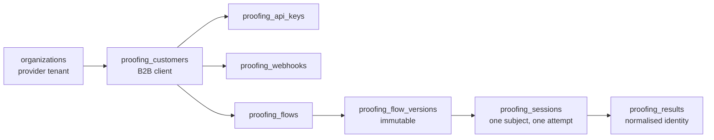
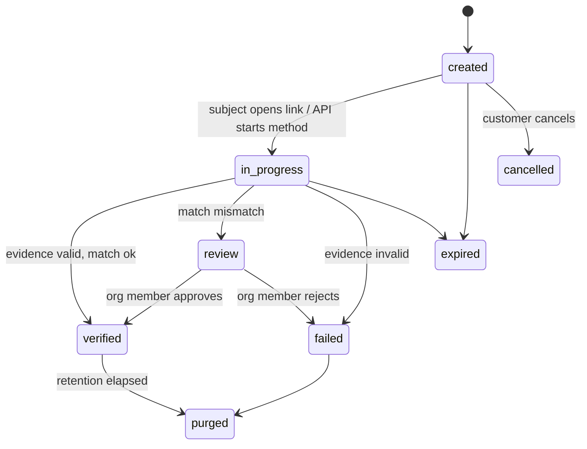
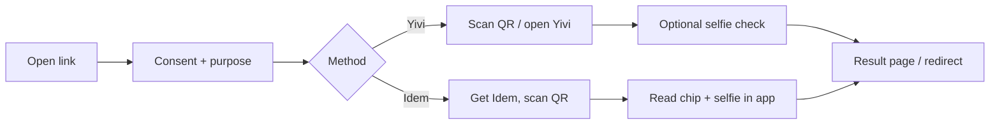

# Identity proofing of external people in the business wallet

Status: **proposed**. Drafted 2026-09-24, revised 2026-09-28. **Decision: the wallet uses the identity-proofing-service as a separate product; it does not fold it in.** See [Decision](#decision-two-products-one-tenancy-model).

## Summary

The business wallet offers **Identity Proofing** as a new product, built on the standalone identity-proofing-service. An org, as a tenant, can then verify the identity of **external people** on behalf of its own B2B customers. It reuses the wallet's tenancy, roles, audit log and EUDI verifier integration and does not build parallel versions of them.

### Goals

1. **API-first.** Every capability is available through a versioned public API before any UI is built on it. The hosted flow and the admin UI use that same API.
2. **Multi-level tenancy.** The **org** (a business wallet tenant) is the provider. It creates **customers** (its B2B clients), and each customer gets its own API keys, branding and webhooks, and an allow-list over the org's **flows**.
3. **Optional white-labelled hosted flow.** A customer either embeds proofing through the API with its own UI, or sends people to a hosted page in the customer's branding, optionally on the customer's own domain.
4. **Two proofing methods at launch:**
   - **Idem**: our white-label document-reading app. It reads the NFC chip of a passport or ID card.
   - **Yivi**: disclosure of existing identity credentials from the Yivi app, over OpenID4VP.
5. **Wallet-native governance.** Every mutation and every proofing outcome is written to the org's audit log. Org members manage customers and flows under the existing role model.

### Non-goals (this phase)

- Extra data points such as VOG, diploma or KvK extract. The flow model leaves room for them (see Extension points), but none ship now.
- Proofing org **members**. Members keep joining through the invitation lifecycle and the personal Yivi app.
- Issuing new credentials to the proofed person. This is a candidate follow-up.
- Billing and metering beyond usage counters.

## Decision: two products, one tenancy model

_2026-09-28._ The identity-proofing-service (IPS) and the business wallet are both products. The wallet is a **customer of IPS**, like any other relying party, and does not absorb it. This is what is built on this branch; `.ai/features/identity-proofing.md` documents it.

| Concern | Owner |
| --- | --- |
| Orgs, members, roles, customers, flow selection per customer, requests, mail, audit log, webhooks to customers, customer API, UI | Wallet |
| Proofing sessions and their state machine, flow definitions and versions, the endpoints the Idem app calls (the deep link's `api=`), chip verification, face match and liveness (engine or Regula) | IPS |

**Tenancy: the wallet's model is the only one the wallet's users see.** We don't want two products each with its own multi-tenant design in front of the same customer.

- One wallet org = one IPS tenant, provisioned by the wallet on first use with the deployment's IPS admin key. The IPS tenant is a technical account, never managed by hand.
- Wallet customers exist only in the wallet. The wallet does not mirror them as IPS sub-tenants; every session runs on the org's tenant and carries the request id as its client reference.
- IPS keeps its own tenancy for its direct customers. The wallet never depends on it beyond "one tenant per org".

**The boundary.**

- The wallet calls only IPS's documented tenant and admin API, and only from `internal/proofingprovider/client.go`. An IPS change the wallet needs is an IPS API change first.
- IPS keeps that API backward compatible for the wallet (additive changes; a breaking change needs a new version and a wallet update in the same release).
- Anything on the session, app or face path is fixed in IPS, not worked around in the wallet. Example: the Regula `tag` bug of 2026-09-28 (`ips:` is not a valid Regula tag) was an IPS fix plus an IPS rebuild.

**Running it locally.** `npm run dev` starts IPS too when `IDENTITY_PROOFING_PROVIDER=ips` (see README). Without it, the built-in stub is used.

**When to revisit: fold the proofing core into the wallet only if** IPS stops being offered as its own product, or a customer or compliance requirement needs sessions and evidence held by the wallet itself. The fold-in design and its slices (8 to 12 weeks for one developer) are in git history: `git show 4cf4a4d:.ai/plans/identity-proofing.md`.

## TODO

_The working list; details per item under [Implementation plan under the decision](#implementation-plan-under-the-decision). Tick an item only when its PR is merged or, for work in the tree, when every check of its repo passes._

**Phase 1: correctness and efficiency**
- [x] 1.1 Regula tag bound to the session, valid format (IPS + vcmrtd)
- [x] 1.2 IPS OpenAPI drift, CORS headers, stale docs
- [x] 1.3 On-screen page no longer hangs on `needs_review`
- [x] 1.4 List reads never call IPS; single reads at most every 10 s
- [x] 1.5 `CreateRequest` reads the customer and the org key once
- [x] 1.6 Deadline job: partial index plus a lease across replicas
- [x] 1.7 IPS events: unknown tenant acknowledged, early event retried
- [x] ~~1.8 Idempotency-Key on session create~~ (dropped, see 1.8; comes back with 4.1)
- [x] 1.9 One provider interface, DB clock for the purge time, stale comments
- [x] 1.9 Feature doc: customers have API keys, and customers can be removed

**Phase 2: IPS efficiency**
- [x] 2.1 IPS status endpoint without images or a data-read audit; wallet reads the full result only when needed
- [x] 2.2 IPS rate limit per tenant instead of per client IP
- [x] 2.3 IPS sets assurance on sandbox and bound-login results

**Phase 3: features**
- [x] 3.1 Test mode: `yp_test_` keys, a sandbox tenant per org, `livemode` in webhooks
- [x] 3.2 Public hosted page `/p/:token`: link, start once, Idem QR and Yivi on the subject's device
- [ ] 3.2 vcmrtd opens from a tapped deep link (vcmrtd repo), so Idem works on the same phone
- [x] 3.2 `session.expired` webhook for a hosted link that lapses unstarted
- [x] 3.3 Manual review plumbing: IPS keeps `needs_review` open and takes a decision; wallet queue filter, decide action, audit
- [ ] 3.3 **Decision needed:** when does IPS send a real session to review? (a trigger in IPS's checks)
- [x] 3.4 Contract tests: IPS `TestRelyingPartyContract`; wallet client test per call
- [ ] 3.5 Custom customer domains (deferred)
- [x] 3.6 A customer takes live requests only with an active live key (`customer_no_api_key`, "Setup needed"); key status and live/test in the keys table
- [x] 3.6 Webhooks: the wallet's own endpoint is the default, a customer's own URL is optional
- [x] 3.7 Handover: a new Idem QR when the app leaves mid-session (needs an IPS relying-party route for a claimed, inactive native slot; `claim-tokens` only refreshes unclaimed slots)
- [x] 3.7 Fresh Idem claim link once the 10-minute claim token lapses in a longer session (`POST /sessions/{id}/claim-tokens`)
- [x] 3.7 Dev: IPS reaches the wallet's callback (`IDENTITY_PROOFING_CALLBACK_URL` via `host.docker.internal`, not `localhost`)

**Phase 4: the rest of the PR #267 design**
- [x] 4.1 Customer API: `result`, `cancel`, `DELETE`, headless methods, Idempotency-Key, cursor pagination, `ps_` ids (the ids before the first external customer)
- [x] 4.2 API key scopes
- [x] 4.3 `session.review_opened` webhook
- [x] 4.4 Audit: API-key actor, `result_read`, `review_decided`, cancel/purge events
- [x] 4.5 Hosted page: consent with decline, NL/EN order, redirect on allowed origins, `postMessage` to allowed origins only
- [x] 4.5 Hosted page: `frame-ancestors` from the allowed origins (`server.PageHeaderer`)
- [x] 4.5 Hosted page: the customer's colour as its theme (`applyOrgTheme`), "Powered by Yivi" line the customer can switch off
- [ ] 4.5 Hosted page: automated accessibility test (WCAG 2.2 AA, with axe) on every hosted step. **Decision needed:** axe has to render the page, which needs a browser DOM (jsdom), and the frontend tests run without one by design (`vitest.config.ts`)
- [x] 4.6 UI: session detail (expandable row + timeline), the identity for admins with each view audited, redirect origins
- [x] 4.6 Per-org pause: the platform admin and the org admin each have one; either stops everything (UI routes, customer API, hosted links)
- [x] 4.6 Flow editor: hosted page per flow (enabled, languages, redirect or thank-you page) with a preview in a customer's branding
- [ ] 4.6 Flow editor: "Run in test mode" (a hosted link is refused in test mode today; needs a scripted outcome kept on the request for its start)
- [ ] 4.6 Flow editor: matching (waits on IPS `expected`, 4.7)
- [ ] 4.7 IPS: identity only from verified DGs, `expected` matching, BSN default `omit`, no portraits in events
- [x] 4.7 Retention as the design: default 30, at most 365 (options 7/30/90/180/365)
- [ ] 4.7 IPS keeps a session's data as long as its customer's retention (needs a per-session retention on IPS's `POST /sessions`)
- [x] 4.8 Yivi over the wallet's OpenID4VP verifier (`ScopeProofing`), face check against the credential portrait
- [ ] 4.8 The face check optional per flow: IPS bound-login always runs it after the disclosure (IPS change)

**Out of scope for now, tracked (IPS hardening)**
- [ ] IPS `callbackUrl` validation (SSRF)
- [ ] IPS webhook secret rotation over HTTP
- [ ] IPS bound-login state survives a restart or a second node
- [ ] IPS long-poll store reads
- [x] Sweep of undeleted Regula liveness transactions: IPS queues each session's `ips-` tag as the app gets it and deletes by tag after the session's end, with retries (`internal/regulasweep`, in the IPS working tree)

**Housekeeping**
- [ ] PR #267: retitle and update the description, or split it into design and implementation
- [ ] Commit the IPS and vcmrtd changes of 2026-09-28

## Context

The standalone [identity-proofing-service](https://github.com/privacybydesign/identity-proofing-service) (main at `7bf5bad`, 2026-09-23) has a strong evidence engine but only thin product plumbing. The business wallet is the reverse: the plumbing is mature, and it has no proofing of people who are not members. The integration takes the engine from one and the plumbing from the other.

| Capability | identity-proofing-service today | Business wallet today | In the integrated product |
| --- | --- | --- | --- |
| Tenancy | `tenants` + `sub_tenants`, managed by `adminctl` or an `ADMIN_KEY` API | `organizations`, memberships, invitations, `Authorize` middleware | org = provider, `proofing_customers` = sub-tenant |
| Admin identity | Yivi email login limited to caesar.nl / yivi.app | OpenID4VP login, roles, mandates, platform admins | Wallet |
| API keys | `sk_test_` / `sk_live_`, hashed, scoped | None inbound | Port the IPS model to `proofing_api_keys` |
| Flows | `flow_versions` with steps, thresholds, assurance, activate | None | Port, keyed on customer |
| Sessions and state machine | created → opened → in\_progress → needs\_review → approved/rejected | Public-token pattern (VOG, re-identification, external signees) | Port the IPS machine; hosted access uses the wallet's token pattern |
| NFC chip verification | `mrtdverify`: Passive Authentication against the ICAO CSCA masterlist, Active Authentication over a server challenge, clone and tamper detection | None | Keep, via the engine |
| Face match and liveness | GhostFaceNet match (0.50) and MiniFASNet liveness (0.65), TFLite over cgo | None | Per flow: the built-in engine, or the Regula Face API we already host for go-passport-issuer |
| Yivi | IRMA requestor disclosure of `pbdf.pbdf.passport` / `idcard`, plus a live face match on the photo | OpenID4VP via the hosted EUDI verifier, `ScopeIdentity` DCQL | Wallet's OpenID4VP path (see Proofing methods) |
| Hosted flow and white-label | Missing: `/api/v1/s/{token}` has no handler, and there is no branding (issue #9) | Themes (`org_theme_settings`), public token pages, `IdentityDisclosure` UI | Build in the wallet |
| Webhooks | HMAC-signed, retry up to 24 h, dead-letter | Transactional outbox for notifications; HMAC inbound for QERDS | Port the IPS semantics onto a wallet outbox |
| Audit | `events` table; photos copied into it | `audit_events` via `Recorder`, per org, transactional | Wallet |
| Manual review | `needs_review` status, no UI | Identity-review queue pattern for platform admins | Build, per org |
| Schema management | `CREATE TABLE IF NOT EXISTS` at startup | goose migrations, `cmd/migrate` | Wallet |

### Gaps we inherit and must close

1. **Chip data is not bound to the claims.** The name, date of birth and reference photo come from the app's JSON. They are not parsed from the verified DG1/DG11/DG2 bytes, so a modified app could pair genuine chip evidence with another name. This is the Idem path only: Idem posts the raw chip bytes (SOD, DGs, AA signature) plus its own parsed JSON, and the server runs Passive and Active Authentication on the bytes but reads the claims from the JSON. **We fix this before launch.**
2. **Assurance is not enforced.** A failed required check only lowers the level, and nothing compares the level achieved with the flow's `required_assurance_level`. `high` is never reached.
3. **Liveness is single-frame** and not certified-grade. We move to a multi-vendor strategy: Regula, already in the Yivi app, is offered next to the built-in model. On the Yivi bound-login path it is `not_performed`.
4. **Bound-login state is held in memory**, which is why the service runs one replica.
5. The vcmrtd deep link does not open the app yet, and the app still posts to the legacy single-shot `/result` endpoint.

## Domain model

The model has three levels of tenancy: the **org** is provider, the **customer** is the org's client, and the **subject** is the person being proofed. The subject is never a user or member of the wallet. Every new table carries `organization_id`, so the existing `/orgs/{slug}` authorisation and audit scoping apply unchanged.


```mermaid
flowchart LR
  O[organizations<br/>provider tenant] --> C[proofing_customers<br/>B2B client]
  C --> K[proofing_api_keys]
  C --> W[proofing_webhooks]
  C --> F[proofing_flows]
  F --> V[proofing_flow_versions<br/>immutable]
  V --> S[proofing_sessions<br/>one subject, one attempt]
  S --> R[proofing_results<br/>normalised identity]
```

An org owns customers. A customer owns flows, API keys and webhooks. Every session is pinned to one immutable flow version.

| Entity | Purpose | Key fields |
| --- | --- | --- |
| `proofing_customers` | A B2B client of the org | organization\_id, name, slug, kvk\_number, status (active/suspended), branding\_id → `org_theme_settings`-shaped row, custom\_domain, allowed\_redirect\_origins\[\], data\_retention\_days, bsn\_policy, legal\_basis, processing\_purpose |
| `proofing_api_keys` | Machine credentials for one customer | customer\_id, prefix (public, shown), secret\_hash (sha256), scopes\[\], environment (test/live), last\_used\_at, revoked\_at |
| `proofing_flows` | A named proofing recipe, e.g. "Tenant onboarding" | customer\_id, key (stable, used in API), name, current\_version\_id, status (draft/published/archived) |
| `proofing_flow_versions` | An immutable snapshot of a flow definition | flow\_id, version, definition JSONB, published\_at, published\_by |
| `proofing_sessions` | One attempt to proof one subject | customer\_id, flow\_version\_id, external\_reference (customer's id for the person), status, method\_used, expires\_at, hosted\_token\_hash, redirect\_url, client\_ip\_hash |
| `proofing_results` | The verified outcome, kept separate so it can be purged | session\_id, identity (encrypted JSONB), assurance\_level, evidence summary, verified\_at, purge\_after |
| `proofing_webhooks` | Outbound result notifications | customer\_id, url, secret\_ciphertext, events\[\], disabled\_at |
| `proofing_webhook_deliveries` | Delivery attempts, fed by the outbox pattern | webhook\_id, event, payload\_hash, attempt, next\_attempt\_at, status |

### Flow definition

A flow version's `definition` is a small declarative document. A later migration can move it into typed tables if it grows.

```json
{
  "methods": [
    {"type": "yivi", "credentials": ["passport", "idcard"], "face": {"provider": "regula", "liveness": true}},
    {"type": "idem", "documents": ["passport", "idcard"], "face": {"provider": "regula", "liveness": true, "min_similarity": 0.75}}
  ],
  "method_selection": "subject_choice",
  "required_claims": ["given_name", "family_name", "birth_date", "nationality"],
  "optional_claims": ["document_number", "portrait"],
  "min_assurance": "substantial",
  "match": {"expected": ["family_name", "birth_date"], "on_mismatch": "review"},
  "steps": [],
  "session_ttl_minutes": 1440,
  "hosted": {"enabled": true, "locale": ["nl", "en"], "completion": "redirect"}
}
```

- `methods` is an ordered list. `method_selection` is `subject_choice` (the subject picks) or `fallback` (the second method is offered only if the first fails).
- `match` compares the result with data the customer sent when it created the session. `identity.Reconcile` does the name normalisation. A mismatch either fails the session or parks it in `review`.
- `face` is optional per method. `provider` is `regula` or `engine`, `min_similarity` overrides the provider's default threshold, and leaving `face` out skips the face check (which caps the level at `low`).
- `steps` stays empty in this phase. It is where VOG and diploma steps go later.

### Session lifecycle


```mermaid
stateDiagram-v2
  [*] --> created
  created --> in_progress: subject opens link / API starts method
  in_progress --> verified: evidence valid, match ok
  in_progress --> review: match mismatch
  in_progress --> failed: evidence invalid
  review --> verified: org member approves
  review --> failed: org member rejects
  created --> expired
  in_progress --> expired
  created --> cancelled: customer cancels
  verified --> purged: retention elapsed
  failed --> purged
```

Each transition is one row in `audit_events`, with `target_type = proofing_session`. `verified`, `failed` and `review` also emit a webhook event.

## Public API

There are two API surfaces on the existing server. Both are documented in `apidocs/openapi.yaml`, whose coverage test checks every route.

- **Management API** at `/api/v1/orgs/{slug}/proofing/...`. Org members call it with their session cookie. The admin UI is built on it.
- **Customer API** at `/api/v1/proofing/...`. Customers call it with their API key, and the customer is resolved from the key. It never takes an org slug.

### Customer API

| Method | Path | Purpose |
| --- | --- | --- |
| `GET` | `/proofing/flows` | List the customer's published flows |
| `POST` | `/proofing/sessions` | Create a session. Returns `id`, `hosted_url` (if hosted is enabled) and `expires_at` |
| `GET` | `/proofing/sessions/{id}` | Status, method, assurance level, timestamps. No PII. |
| `GET` | `/proofing/sessions/{id}/result` | The verified identity and evidence. Needs the `results:read` scope, and every call is audited. |
| `POST` | `/proofing/sessions/{id}/cancel` | Cancel a session that is not yet finished |
| `DELETE` | `/proofing/sessions/{id}` | Purge the result now (erasure) |
| `POST` | `/proofing/sessions/{id}/methods/{method}` | Headless: start Yivi or Idem directly and get back a `wallet_link` / `app_link` plus a `poll_token`, for customers building their own UI |
| `GET` | `/proofing/sessions/{id}/methods/{method}/status` | Headless poll |

Creating a session looks like this:

```json
POST /api/v1/proofing/sessions
Idempotency-Key: 7c1e…
{
  "flow": "tenant-onboarding",
  "external_reference": "applicant-4812",
  "expected": {"family_name": "Jansen", "birth_date": "1990-04-12"},
  "redirect_url": "https://portal.customer.nl/done",
  "locale": "nl"
}
→ 201
{
  "id": "ps_01J…",
  "status": "created",
  "hosted_url": "https://verify.customer.nl/s/Hk3…",
  "expires_at": "2026-09-25T10:00:00Z"
}
```

A result looks like this:

```json
{
  "id": "ps_01J…",
  "status": "verified",
  "method": "idem",
  "assurance_level": "substantial",
  "verified_at": "2026-09-24T10:03:11Z",
  "identity": {"given_name": "Anna", "family_name": "Jansen", "birth_date": "1990-04-12", "nationality": "NLD"},
  "match": {"family_name": "exact", "birth_date": "exact"},
  "evidence": [
    {"type": "emrtd", "document_type": "passport", "issuing_state": "NLD", "expiry_date": "2031-02-01",
     "passive_auth": "valid", "active_auth": "valid", "face_match": 0.81, "liveness": "passed"}
  ]
}
```

### Webhooks

- Events: `session.verified`, `session.failed`, `session.review_opened`, `session.expired`.
- The payload carries the ids and the status only, **never PII**. The customer fetches the result with its API key. A leaked webhook endpoint therefore leaks no identity data.
- Each delivery is signed as `X-Proofing-Signature: t=<ts>,v1=<hmac-sha256>`, with the same HMAC construction as the inbound `qerds/webhook.go`.
- Delivery goes through a transactional outbox, like `notification_outbox`, with retries and exponential back-off over 24 hours. Delivery history is visible in the UI.

### Conventions

- Idempotency keys on every POST, reusing the `session.Store.Mint` idempotency pattern.
- Errors use the existing `respond` envelope.
- Cursor pagination on lists.
- Session ids are prefixed opaque ids, never the database UUID.

## Hosted white-labelled flow

The hosted flow is an optional public page that runs a proofing session end to end in the customer's branding. A customer that does not want it uses the headless API and builds its own screens.

- **Where it lives.** A public route `/p/:token` in the wallet frontend, next to `/vog/:token` and `/sign/:token`. It reuses `IdentityDisclosure` (QR code plus polling), `Stepper` and `Outcome`. Neither the wallet shell nor its navigation is shown.
- **Branding.** The page loads the full customer theme (palette, font, logo, name) from `GET /public/proofing/{token}/theme`, before first paint, with no member login. Nothing on the page says "Yivi business wallet" except an optional "powered by" line, which the customer can switch off.
- **Domains.** The default is `https://<customer-slug>.verify.<wallet-domain>/p/<token>`. The customer can add a custom domain through a CNAME, with TLS issued automatically. `hosted_url` in the API always returns the customer's preferred domain.
- **Locales.** NL and EN at launch, chosen from the session's `locale`, the browser, and the flow's allowed list, in that order.
- **Completion.** The page either redirects to `redirect_url` (whose origin must be in `allowed_redirect_origins`) with `?session=<id>&status=<status>`, or shows a branded done page. The redirect is only a UX hint. Customers must confirm the status server-side through the API or a webhook.
- **Embedding.** The page can run in an iframe only on origins in `allowed_redirect_origins` (set through `frame-ancestors`). It posts `{type:"proofing.completed", session, status}` to the parent, restricted to that origin.

### Subject journey


```mermaid
flowchart LR
  A[Open link] --> B[Consent + purpose]
  B --> C{Method}
  C -->|Yivi| D[Scan QR / open Yivi]
  C -->|Idem| E[Get Idem, scan QR]
  D --> F[Optional selfie check]
  E --> G[Read chip + selfie in app]
  F --> H[Result page / redirect]
  G --> H
```

The subject sees consent, then picks a method (or gets the flow's fixed one), then completes it on the phone.

- **Consent screen.** It shows the customer's name, the purpose (`processing_purpose`), the data requested, the retention period and a privacy-statement link. Declining cancels the session.
- **Device handover.** When the page is opened on desktop, Yivi and Idem both continue on the phone through a QR code, and the desktop page follows the phone by polling. This builds on the `Session-Flow` branch's device binding and handover.
- **Accessibility.** The page must meet WCAG 2.2 AA, which public-sector customers in NL require.

## Proofing methods

Both methods produce the same normalised result: `identity`, an `evidence[]` entry and an eIDAS-style `assurance_level`. A customer can therefore offer both methods without having to write separate integrations.

### Idem: document-reading app

- **Binding.** Identity fields and the face reference come **only** from the engine's parse of the verified DG1/DG11/DG2 bytes. The wallet ignores any `document` or `photo` JSON the app sends. This closes the service's main gap.
- **Checks** at launch: Passive Authentication (SOD signature, DS → CSCA against the ICAO masterlist, DG hashes), Active Authentication over a wallet-issued 8-byte challenge, clone and tamper detection, document expiry, face match, liveness. Face match and liveness go through the flow's face provider: Regula by default, which the Yivi app already uses, or the built-in model.
- **White-label app.** The app is a single Idem binary, not a build per customer. At runtime it gets the customer's name, logo and colours from `GET app/{token}`.
- **Documents.** ICAO passports and ID cards at launch. EU driving licences stay out until CSCA trust exists for them (issue #24).

### Yivi: credential disclosure

- **Protocol.** The flow uses OpenID4VP through the wallet's existing `openid4vpverifier` client and the hosted EUDI verifier, with a `ScopeProofing` DCQL query over the passport or ID-card SD-JWT credential (`pbdf-staging.*` on staging). We drop the standalone service's IRMA requestor path so that there is one verifier integration. The one wallet client is also what `auth` and `organization` already use.
- **Result.** Claims are extracted as `auth/disclosure.go` `extractIdentity` does today, and the credential's `iat` (`IdentityIssuedAt`) is recorded. A flow can set a maximum credential age.
- **Optional live-face check.** This is the standalone service's `biometric_bound_login`: the credential's photo becomes the reference, and the subject's live face is matched against it through the flow's face provider. With Regula, the hosted page runs the Regula web liveness component. The Yivi passport, ID-card and driving-licence credentials all carry a portrait claim, so the check runs on the Yivi path. It proves that the person holding the phone is the credential holder, not just someone with access to the phone.
- **Assurance.** Yivi passport and ID-card credentials are themselves issued after an NFC chip read with Passive and Active Authentication. The level therefore derives from the credential's issuance, plus the face check if it ran.

### Assurance levels

The level is computed from the checks that passed and **enforced** against the flow's `min_assurance`. A session that falls short becomes `failed` with `ASSURANCE_NOT_MET`, or goes to `review` if the flow says so. It is never approved at a lower level.

| Method and checks passed | Level |
| --- | --- |
| Idem: PA + AA + face match + liveness | substantial ? |
| Idem: PA + AA, no face | low |
| Idem: PA failed, or clone/tamper detected | rejected (never downgraded) |
| Yivi: passport or ID-card credential + live face match | substantial |
| Yivi: passport or ID-card credential, no face | low |

**High** is out of scope for phase 1. Reaching it needs certified liveness (for example ISO 30107-3 / iBeta level 2) and conformity assessment against ETSI TS 119 461. The single-frame liveness model we have today is not certified-grade. Regula, already a face provider, is the first candidate for the certified route. We still need to confirm its PAD certification level and how it maps onto TS 119 461.

## Management UI in the business wallet

Identity Proofing gets its own top-level section, `/:orgSlug/proofing`, alongside members, QERDS, signing and attestations. It is gated by a per-org product toggle. Reading is open to members; writes require `RequireOrgAdmin`, until the RBAC model in `.ai/plans/rbac-model.md` lands and adds a `proofing:manage` permission.

| Route | What the org sees and does |
| --- | --- |
| `/proofing` | Overview: customers, sessions in the last 30 days by status, and the review queue count |
| `/proofing/customers` | List of customers; create, suspend |
| `/proofing/customers/:id` | Tabs: **Flows**, **Branding**, **API keys**, **Webhooks**, **Sessions**, **Settings** (retention, allowed redirect origins, custom domain) |
| `/proofing/customers/:id/flows/:key` | Flow editor. The draft is shown next to the published version, with Publish producing a new immutable version |
| `/proofing/sessions/:id` | Session detail: timeline built from the audit events, method, assurance level, and the match outcome. The identity is shown only to admins, and each view is written to the audit log. |
| `/proofing/review` | Queue of sessions in `review`. Approve or reject, with a mandatory reason. |

### Flow editor

The editor is a form over the flow definition, not a visual canvas. There is little to arrange in this phase, and a form is quicker to build and to review.

1. **Methods.** Toggle Yivi and Idem, pick the accepted documents or credentials, and choose `subject_choice` or `fallback`.
2. **Data.** Tick the required and optional claims. Only the claims the enabled methods can deliver are offered.
3. **Assurance.** Set the minimum level (low / substantial / high). Methods that cannot reach it are disabled in step 1.
4. **Matching.** Choose which fields the customer must send with the session, and what happens on a mismatch.
5. **Hosted flow.** Enable it or not, set the locales and completion behaviour (redirect or a thank-you page), and preview it with the customer's branding.
6. **Test.** "Run in test mode" creates a test-environment session and opens the hosted flow in a new tab.

### Branding

The **Branding** tab reuses `theme-settings.tsx` and the `org_theme_settings` shape: palette, font and logo. It is keyed on customer, not org. Unlike member pages, the hosted flow serves the full theme, logo included, without login, from `GET /public/proofing/{token}/theme`. This is safe because the branding is public by design.

Personal data never shows up in list views. Session lists show `external_reference`, status, method and time only.

## Security, privacy, retention and audit

The wallet processes identity data **as processor** for its org, and the org processes it on behalf of its customer. The design therefore stores the least it can, encrypts what it keeps and deletes on a schedule by default.

### Authentication and authorisation

| Caller | Mechanism | Scope |
| --- | --- | --- |
| Org member (management UI) | Existing session cookie, `Authorize` middleware, `RequireOrgAdmin` for writes | All customers of the org |
| Customer backend (public API) | API key `ipk_live_<prefix>_<secret>` as bearer. Stored as sha256 plus prefix, compared in constant time, shown once. | One customer, filtered by key scopes (`sessions:write`, `sessions:read`, `results:read`, `flows:read`) |
| Subject (hosted flow) | 32-byte random session token in the link, stored as sha256, single session, TTL from the flow | One proofing session |
| Idem app / Yivi verifier | Method-specific. Idem uses the session's app token plus a server-issued Active Authentication challenge; Yivi uses a verifier transaction id bound to the session row. | One proofing session |

- **Bind method sessions to the proofing session.** The `*-session` / `*-complete` endpoints in the VOG and re-identification flows have a gap: the presentation id they create is not bound to the public token. We close that gap here. The `presentation_sessions` row gets a `proofing_session_id`, and a completion call is honoured only for that pairing.
- **Rate limiting** does not exist anywhere yet. We add it for the public API (per key) and the hosted flow (per token and per IP). This is a blocker for this feature, not a nice-to-have.
- **Test and live keys** are separate. Test-mode sessions run against the dev verifier and the stub Idem, and never reach real evidence services.

### Data minimisation and encryption

- The portrait and raw chip data (DG1/DG2/DG11, SOD) are **not stored** by default. The result keeps a hash of the SOD and the outcomes of Passive and Active Authentication. A flow can opt in to returning the portrait once, through the result API, without persisting it. Photos and selfies never go into the audit log. The standalone service copies them into `proofing.result.verified` events; we drop that behaviour.
- `document_number` is stored only as a keyed hash unless the flow asks for it. This mirrors `member_screenings.reference_hash`.
- **BSN defaults to `omit`.** The standalone service's `bsn_policy` (`retrieve` / `mask` / `omit`) moves to the customer. A platform admin can set `retrieve` only once the customer has recorded a `legal_basis` and `processing_purpose`. The Yivi method never requests BSN.
- Session bearer tokens are stored as sha256. The standalone service stores them in plaintext.

### Retention

- Each customer has a `data_retention_days` setting (default 30, maximum 365). A new `ProofingPruner`, started next to `startPruner` in `cmd/api/main.go`, clears `proofing_results.identity` after that period and moves the session to `purged`. The session row and the assurance level stay as proof that a check happened.
- Unfinished sessions expire at `expires_at` and keep no evidence at all.
- A customer can delete a session through the API (`DELETE /sessions/{id}`), which purges it at once. This is how data-subject erasure requests are handled.

### Audit log

Everything goes through `audit.Recorder.Record` inside the same `database.InTx` as the mutation, with `organization_id` set to the provider org. The customer id goes in `metadata`, so the org's audit page can filter on it. API-key callers get a synthetic actor (`api_key:<prefix>`) because `actor_user_id` is null for them.

| Action | Target | Metadata (readable values only, never tokens or PII) |
| --- | --- | --- |
| `proofing_customer.created` / `updated` / `suspended` | proofing\_customer | before/after via `audit.Updated` |
| `proofing_api_key.created` / `revoked` | proofing\_api\_key | prefix, scopes, environment |
| `proofing_flow.published` / `archived` | proofing\_flow | version, methods |
| `proofing_session.created` / `started` / `verified` / `failed` / `review_opened` / `review_decided` / `expired` / `purged` | proofing\_session | customer\_id, flow\_key, version, method, assurance\_level, failure\_reason |
| `proofing_result.read` | proofing\_session | api key prefix. Every read of identity data is logged. |
| `proofing_webhook.created` / `disabled` | proofing\_webhook | url host, events |

The audit log never contains names, dates of birth or document numbers. It records *that* a person was proofed, at which level and by which method. The identity itself stays in the encrypted, purgeable result.

## Extension points: additional data points

VOG, diploma and similar checks slot in later as **steps** that run after identity is established. Adding one needs a new step type and nothing more: no schema change, no API change.

- **Step contract.** A step gets the verified identity from the session. It produces a typed `evidence` entry in the result (for example `{"type":"vog","outcome":"valid","issued_at":…}`) and can fail or park the session. `flow.definition.steps` lists them in order.
- **VOG** reuses what `member-screening-vog` already has: `vog` parsing and validation of Justis PDFs, `ScopeVog` / `ScopeIdentityVog` disclosure, and the name-plus-date-of-birth match. The only new part is running it against a proofing subject instead of a membership.
- **Diploma** (DUO) and others follow the same route: a credential disclosure through Yivi where one exists, a document upload with a validator where it does not.
- Hosted-flow screens are per step, so the frontend adds one component per step type.

Nothing in this list ships in phase 1. The one constraint for phase 1 is that `steps` is present in the definition schema, and that result evidence is an array rather than a single identity object.

## Delivery plan

### Implementation plan under the decision

_Written 2026-09-28 from a full read of PR #267, this plan and the working trees of this repo, identity-proofing-service (IPS) and vcmrtd; checked against the code while implementing. Status per item below._

#### Rules for the implementer

- **The architecture is fixed.** Two products: the wallet is a customer of IPS over HTTP, one wallet org = one IPS tenant, customers exist only in the wallet. Do not move session, app or face logic into the wallet. Do not add wallet-side workarounds for IPS behaviour: fix IPS.
- **One work item = one branch = one PR**, in the order below. Each PR must pass that repo's full verify sequence before it is opened:
  - wallet backend: `cd backend && go tool golangci-lint fmt --diff && go vet ./... && go vet -tags=integration ./... && go build ./... && go tool golangci-lint run ./... && go test -race ./...`
  - wallet frontend: `cd frontend && npm run format && npm run lint && npm run typecheck && npm run build && npm test`
  - IPS: `cd backend && gofmt -l . && go vet ./... && go test ./...`, plus regenerate `docs/api/openapi.yaml` with swag (CI job `openapi-drift` fails on any diff).
  - vcmrtd: `flutter analyze` (no new errors or warnings) and `flutter test` in each touched package.
- **Every behaviour change has a test** that fails before the change. Every bug fix below names the test to add.
- **An IPS API change is additive.** New fields and endpoints only; nothing existing changes shape. Update `docs/api/openapi.yaml` and `docs/session-model.md` in the same PR.
- **The wallet reaches IPS only through `backend/internal/proofingprovider/client.go`.** A new IPS call means a `Client` method, a `Stub` method with the same behaviour, a `client_test.go` case, and the method on **both** interface copies (`internal/proofing/service.go:24` and `cmd/api/main.go:157`). Item 1.9 removes the second copy.
- **Match the file you edit.** Comment density, naming, error handling. Comments stay a line or two. No new lint disables without an inline reason. No magic values.
- **Efficiency is a requirement, not a nice-to-have.** No IPS call inside a loop over rows, no repeated `ListFlows` in one request, no polling a status that cannot change, and every new query that scans across orgs has a matching index.
- Update `.ai/features/identity-proofing.md` in the same PR as the behaviour it describes (the Harvest step).

#### Current state in one paragraph

Phase 0 works end to end: members and the customer API create requests, IPS runs the session, the Idem app does chip and Regula face checks against IPS, and IPS pushes outcomes to `POST /api/v1/identity-proofing/ips-events`. The wallet maps the outcome onto the request, the audit log and customer webhooks. Built: customers, flows through IPS, API keys (`yp_live_` only), webhooks with outbox and retries, branding fields, rate limits on the customer API, and the proofed-name pruner. Not built: a public hosted page, a review queue, test mode and custom domains. The round below first fixes real bugs and inefficiencies found in this read, then builds features in value order.

---

#### Phase 1: correctness and efficiency (do first, small PRs)

##### 1.1 IPS: restore the Regula tag binding, with a valid tag (security)
**Status: done 2026-09-28, revised.**
- The tag is `ips-<tenantReference>`, not the session id as first planned. The tenant reference is random, already meant to be shared outside IPS, and fits Regula's `[A-Za-z0-9_-]`, so it needs no new column.
- `Verify` refuses an untagged transaction or one tagged for another session.
- Tests: `TestRegulaSelfieStep` ("tag of another session", "untagged transaction") and `TestRegulaTagIsValidAndNotTheSessionID`.
- vcmrtd passes the tag again, and its tests use valid tags. The tag was removed on 2026-09-28 on request. Without it, `regulaFaceVerifier.Verify` (`backend/internal/api/face_verifier.go`) accepts **any** transaction id known to the shared Face API, including one from another IPS session, another tenant, or go-passport-issuer, which shares the instance. The face match still has to pass, but the transaction is not bound to the session.
- IPS: `regulaTag(sess) = "ips-" + sess.ID`. Regula allows only `[A-Za-z0-9_-]`, max 127 characters. Announce it again in `faceVerificationInfo.Tag`, and reject on mismatch with `errForeignTransaction`. Fix the stale "checks its tag" comment. The tests already set `Tag: "ips-"+id`; add back the "tag of another session" case.
- vcmrtd (`idem`): pass `faceVerification.tag` to `captureLiveness(tag:)` again. Keep the `fromSession` flag added on 2026-09-28; it is still the right signal for `requiredBySession`.
- **Done when:** an IPS test rejects a transaction tagged for another session, and an idem test asserts that the tag reaches `LivenessConfig`.

##### 1.2 IPS: OpenAPI drift and CORS
**Status: done 2026-09-28.** The spec was regenerated with `make openapi` (stable on a rerun), CORS got a test (`cmd/server/cors_test.go`), and the docs were fixed. The lint finding in `dispatchWebhook` (QF1001) was fixed along the way.

- Regenerate `docs/api/openapi.yaml`. `POST /sessions/{id}/reference` (`bound_login_reference.go:65`) is missing, so `openapi-drift` fails on the current tree.
- In `cmd/server/main.go` (around line 625), `Access-Control-Allow-Headers` lacks `X-Device-Token` and `Idempotency-Key`, so device-bound app calls fail cross-origin even from localhost. Add both.
- Fix the stale docs: `session-model.md:277` (the deep link uses `?handover=`, not `?token=`) and `:338` (`NativeHandoff` is `{role, claimed}`). Drop the false "done" claim for the hosted flow in `requirements.md:164`.
- **Done when:** `openapi-drift` passes locally, and a CORS preflight test asserts both headers.

##### 1.3 Wallet: the on-screen page hangs on `needs_review`
**Status: done 2026-09-28.** `needs_review` is no longer live, and the page has its own "Waiting for review" outcome (EN/NL). The repo has no component tests, so the `isProofingLive` unit test covers it.

- `isProofingLive` (`frontend/src/lib/identity-proofing.ts:26`) counts `needs_review` as live, so `customer-verify.tsx` keeps showing the QR and countdown and never reaches the outcome. `SessionOutcome` (`customer-verify.tsx:769-779`) would also label it "expired".
- Change it: `needs_review` is **not live** for polling or for the session UI. Give it its own outcome state ("waiting for review"). Keep the amber tone.
- **Done when:** a frontend test shows that a `needs_review` response renders the review outcome and stops polling.

##### 1.4 Wallet: stop polling IPS for statuses that are pushed
**Status: done 2026-09-28, revised.**
- Reconciling on read was a documented fallback, so it was kept for single-request reads (`readReconciled`, at most once per `readReconcileEvery` per request, `read_throttle.go`).
- List reads never call IPS.
- Tests: `TestListReadsNeverCallIPS`, `TestARequestReadRechecksIPSAtMostOncePerInterval`.

- Lists poll every 10 s while any row is live (`api/identity-proofing.queries.ts:241-244`), and each poll reconciles up to 10 rows at IPS (`service.go:607-627`). Every reconcile is a full `GET /sessions/{id}/result`: audited at IPS as `proofing.data.read`, with images, up to 32 MiB.
- IPS pushes every outcome, and the deadline job covers missed pushes. So reads must **not** reconcile: `Requests`/`Request`/`CustomerRequest` return stored state. Reconcile only in `HandleIPSEvent`, `SessionChanged` (stub) and `ReconcileDue`.
- Keep one exception: `Request` for an on-screen session may reconcile **at most once per 10 s per request**. That makes a missed push visible within the page's lifetime. Use the existing `updated_at`; don't add a new cache.
- Frontend: keep polling the wallet (it's cheap now), but only for `pending`/`in_progress`.
- **Done when:** a service test asserts that listing 10 live requests makes zero provider calls.

##### 1.5 Wallet: `CreateRequest` does the same work several times
**Status: done 2026-09-28, corrected.**
- `ListFlows` already ran only once per create. The real duplication was the customer read (3×) and the org key (2×). Both are now read once, and the customer path skips the members' selection read.
- Test: `TestCreateRequestResolvesEachDependencyOnce`.

In `service.go:401-471`: `sendableFlow` → `s.Flows` does `orgAPIKey` plus IPS `ListFlows` on every send, including every public-API create. `orgAPIKey` then runs again at `:421`. `customers.Get` runs up to 3 times (`:515`, `:570`, `:595`), and `CustomerFlows`/`validSelection` call `ListFlows` again (`:246`, `:765`).
- Resolve the org key once per call, and the customer once, then pass them down.
- Fetch `ListFlows` **once** per `CreateRequest` and look the flow up in that slice.
- **Done when:** a service test with a counting fake provider asserts exactly one `ListFlows` and one `CreateSession` per `CreateRequest`, and a counting customer store asserts one `Get`.

##### 1.6 Wallet: deadline job index and multi-replica safety
**Status: done 2026-09-28.**
- Migration `20260928150000`: an `ips_reconcile_leased_until` column plus a partial index.
- `ListDue` leases rows with `FOR UPDATE SKIP LOCKED` for `deadlineRetry`.
- The lease is covered in `TestRequestStoreSessionDeadlines`, and the full integration suite passes.

- `ListDue`/`NextDeadline` (`request_store.go:150-189`) scan across all orgs on `ips_session_expires_at` with no matching index. Add a migration: `CREATE INDEX ... ON identity_proofing_requests (ips_session_expires_at) WHERE ips_session_id IS NOT NULL AND ips_session_ended_at IS NULL AND status IN ('pending','in_progress')`.
- Every API replica runs `ReconcileDue`, and `ListDue` doesn't lease rows, so N replicas make N IPS reads per due session. Lease the rows with `FOR UPDATE SKIP LOCKED` inside a short transaction, the same way the webhook deliverer does. Alternatively, claim them with an `UPDATE ... RETURNING` on a `reconcile_claimed_until` column; pick whichever matches the deliverer's pattern.
- **Done when:** an integration test with two concurrent `ReconcileDue` calls makes one provider read per due row, and `EXPLAIN` on the `ListDue` query uses the index (assert in the integration test, or note it in the PR).

##### 1.7 Wallet: the IPS event handler
**Status: done 2026-09-28.**
- An unknown tenant is acknowledged.
- A fresh event (under 2 minutes, `earlyEventWindow`) for a session not stored yet that names a request (`clientReference`) answers 503 so IPS retries; anything else unknown is acknowledged.
- Test: `TestHandleIPSEventBeforeTheSessionIsStoredIsRetried`.

- An unknown tenant answers 401 (`ips_events.go:53-55`), so IPS keeps retrying for a deleted org for about a day. Answer `202` and log it; do no work.
- **Race:** IPS can push before `AttachSession` has stored `ips_session_id`. This always happens with sandbox scripted outcomes (IPS resolves them inside the create call), so the event is dropped today (`ips_events.go:62-67`). The minimal payload carries `clientReference`, which is the request id. Fall back to the request id when the session id is unknown, and check that the request belongs to that tenant's org.
- **Done when:** tests cover an unknown tenant getting 202 with no DB write, and an event before attach that is applied via `clientReference`.

##### 1.8 Wallet: idempotent session creation
**Status: dropped.** The wallet never retries `CreateSession`, and each request id is new, so the header would never be reused. Revisit it together with 4.1's idempotency keys, where a customer retry maps to the same request.

IPS supports `Idempotency-Key` on `POST /sessions`, but the wallet never sends it. Send `Idempotency-Key: <request id>`, so a retried create never makes two sessions.
- **Done when:** `client_test.go` asserts the header.

##### 1.9 Wallet: small cleanups
**Status: done 2026-09-28, except the stub item.**
- One exported `proofing.Provider`, embedded by `main.go`.
- `RecordOutcome`'s purge time now comes from the database clock.
- The stale comments are fixed.
- The stub's O(n) lookup was left alone (dev only).
- The two feature-doc lines are fixed.

- **One provider interface.** Delete the copy at `cmd/api/main.go:157-170`, export the one in `internal/proofing`, and add `Ping` to it.
- `RecordOutcome` uses `time.Now()` for `purgeAfter` (`request_store.go:457`). Use the service clock.
- **Fix stale comments:**
  - `proofing.go:21-23` (outcomes are pushed, not reconciled on read)
  - `handler.go:24-28` (there are no public recipient routes)
  - `client.go:183` (there is no restart)
  - `request_store.go:93-94`
- **Fix the feature doc:**
  - `.ai/features/identity-proofing.md:77` (customers do have API keys)
  - `.ai/features/identity-proofing.md:83` (customers can be removed; see `CustomerStore.Remove`)
- **Stub:** index Yivi sessions by token instead of looping over every session (`stub.go:264-277`), and drop expired sessions on access.

---

#### Phase 2: IPS efficiency the wallet depends on

##### 2.1 IPS: a status endpoint without images and without a data-read audit
**Status: done 2026-09-28.**
- `GET /sessions/{id}/status` returns status, assurance, `disclosure` (bool) and devices; it is not audited as a data read.
- The wallet reconciles on it and reads `/result` only for an approved customer subject.
- `Client.SessionStatus` falls back to `/result` on a 404, so the two deploy in either order.
- Tests: `TestSessionStatusIsNotAPersonalDataRead` (IPS); `TestReconcileReadsTheFullResultOnlyForTheName` and `TestSessionStatus*` (wallet).

Add `GET /api/v1/sessions/{id}/status` (scope `sessions:read`). It returns `{status, errorCode, completedAt, flowVersion, assurance: {level, eidasLevel}}`, with no document, images or evidence, and it writes no `proofing.data.read` audit.
- Wallet: `tryReconcile` calls `SessionStatus` first. It calls the full `SessionResult` **only** when the status is `approved` **and** the request needs the proofed name (a customer subject). The stub mirrors this.
- **Done when:** an IPS test asserts no audit row and no image fields, and a wallet test asserts that a rejected outcome makes zero `SessionResult` calls.

##### 2.2 IPS: rate-limit session creation per tenant, not per client IP
**Status: done 2026-09-28, simplified.**
- `POST /sessions` authenticates first, then limits per tenant with the existing `CREATE_SESSION_RATE_LIMIT`.
- No second config value: the route needs a valid key anyway.
- Test: `TestCreateSessionIsRateLimited` (a second tenant from the same IP keeps its budget).

`POST /sessions` is limited to 30/min per client IP (`sessions.go:2023`, `ratelimit.go:80-86`). Behind the wallet's single egress IP, that caps every org combined. For API-key-authenticated calls, key the limiter on the tenant id, and keep the per-IP limit for unauthenticated routes. Make the per-tenant limit a config value, defaulting to 30/min.
- **Done when:** a test shows two tenants from the same IP each get their own budget.

##### 2.3 IPS: assurance on sandbox and bound-login results
**Status: done 2026-09-28.**
- A scripted approval claims the flow's required level, or substantial when it requires none.
- A bound login claims `low`, by IPS's own `computeEIDASAssuranceLevel` rule.
- The wallet's `yiviEIDASLevel` stays as a fallback for an older IPS.

- Scripted sandbox results have no `result.assurance`, so the wallet stores an empty level. Set it from the flow's declared level.
- Bound-login (Yivi) results have no assurance either. Set `low`, which is the wallet's existing rule, so it lives in IPS.
- **Done when:** tests assert `result.assurance.level` on both.

---

#### Phase 3: features, in value order

##### 3.1 Test mode (plan item D)
**Status: done 2026-09-28, revised.**
- The sandbox tenant has none of the org's flows (flows are per IPS tenant), which the plan missed. A test session is therefore created without a flow and always scripted, and the wallet still validates and records the customer's flow.
- The outcome is reconciled right after create, so it lands without waiting for IPS's push, and without the retry from 1.7.
- Test requests send no mail.
- Tests: `TestATestRequestRunsScriptedOnTheSandboxTenant`, `TestOnlyATestRequestScriptsAValidOutcome`, `TestAnIPSEventFromTheOtherTenantOfTheOrgIsIgnored`, `TestWebhookDataCarriesLivemode`, `TestIdentityProofingTestKeyHTTPFlow`, plus the store and client tests.
- Feature doc §5.

Customers need to integrate without real passports. The design keeps one tenancy model:
- **IPS:** no new route. `POST /admin/tenants {name, sandbox: true}` already creates a sandbox tenant (`admin.go:41-44`); only 2.3 is needed.
- **Wallet:**
  - Each org gets a second, sandbox IPS tenant, provisioned on first test use exactly like the live one. Store it in `org_identity_proofing_settings` (`sandbox_tenant_id`, `sandbox_api_key_ciphertext`, `sandbox_webhook_secret_ciphertext`).
  - Customer keys get a `yp_test_` prefix (`apikey_store.go:20-30`, `Authenticate` at `:162-180`) and a `mode` column (`live`/`test`, default `live`).
  - Requests get a `mode` column. A test request uses the sandbox tenant and may pass `scriptedOutcome` through the public API.
  - Test requests are excluded from stats (`request_store.go:534-561`).
  - Webhook payloads carry `"livemode": false`.
  - `HandleIPSEvent` resolves both tenants through `settings.ByTenant`.
- **UI:** a key-creation toggle "test key", and a "Test" badge on test requests.
- **Done when:** an integration test creates a test key, creates a request with `scriptedOutcome: approve`, receives the pushed outcome (this relies on 1.7's race fix), and sees it excluded from stats and marked `livemode: false` in the webhook. A live key cannot pass `scriptedOutcome` (400).

##### 3.2 Public hosted page on the subject's own device (plan item A)
**Status: wallet part done 2026-09-28, revised.**
- The IPS session is created when the subject starts, not at create. IPS caps a session at 15 minutes, while a link lives `HostedLinkTTL` (72 h).
- Limits are per link token instead of per IP: the wallet sits behind a proxy with no trusted client IP, and the token is the credential. Matches `/vog/{token}` and `/sign/{token}`.
- Return URLs, consent, locales, embedding and desktop handover moved to 4.5.
- Open: vcmrtd deep-link handling (other repo), and a `session.expired` webhook when a link lapses unstarted.
- Tests: `TestAHostedLink*` and `TestAHostedRequestNeedsACustomerAndALiveKey` (unit), `TestRequestStoreHostedLink`, `TestIdentityProofingHostedLinkHTTPFlow`.
- Feature doc §7.

A customer (via the API) or a member sends a link, and the subject opens it on their own phone.
- **Wallet backend:**
  - A `hosted` channel on `NewRequest` (`proofing.go:365-376`). It creates a link token with the existing public-token pattern: 32 random bytes, base64url, only the SHA-256 stored, lookup by hash. Copy `signing/store.go:703-714` and `SignerByToken` at `:292-316`. Add a `link_token_hash` column plus a unique index.
  - Public routes under `/api/v1/p/{token}`: `GET` (preview: flow summary, customer branding, method choice, expiry), `POST /start` (Yivi or Idem), `GET /status`, and the Yivi `start|disclosure|face` routes scoped by token instead of by org and member. Refactor `yiviSession`/`StartYivi`/`YiviDisclosure`/`FaceFrame` (`service.go:839-948`) so the org path and the token path share one implementation.
  - A public, token-scoped logo route. The existing logo route is member-only.
  - Per-IP rate limits on every public route (reuse `internal/ratelimit`), plus per-token limits on `face`.
  - Optional return URL: a per-customer `allowed_return_origins text[]`, validated with `safehttp.Policy{}.CheckURL`, and `returnUrl` on create must match one of them exactly by origin. The API response carries `hostedUrl`.
  - Audit events for a hosted open and start.
- **Frontend:**
  - Route `/p/:token` in the public block (`router.tsx:172-188`).
  - Reuse the `customer-verify.tsx` components (Overview, MethodChoice, Session, YiviSession, FaceCheck) by parameterising them off a data source instead of `slug`. Don't copy them.
  - Apply `primary_color` as the page accent.
- **Idem on the same phone** needs the deep link to open the app, and today it doesn't (`session-model.md:286-290`). vcmrtd must register the `vcmrtd://` scheme on Android and iOS and handle `verify?handover=...&api=...` on cold and warm start. Until that ships, the hosted page shows Idem only with a "scan from another device" QR, and Yivi as the same-device option.
- **Done when:**
  - An integration test runs create hosted → preview → start Yivi → outcome through the public routes only.
  - A token for another org's request is 404.
  - An expired token is 410.
  - The rate limit returns 429.
  - An e2e test on a phone completes a branded Yivi flow (manual, noted in the PR).

##### 3.3 Manual review (plan item B), gated
**Status: plumbing done 2026-09-29; the trigger is still a product decision.**
- IPS: `IsExpired` and the bulk expiry skip `needs_review`. `POST /sessions/{id}/decision` takes `{status, errorCode?, reason, reviewer}`, is audited, sends the result webhook, and a second decision is 409 (`review.go`, `review_test.go`).
- Wallet: `DecideReview` (`review.go`), `POST .../requests/{id}/review` (admin), a "Needs review" filter and decide panel on the Sessions tab, and the count on the overview.
- The queue is the Sessions filter, not a separate page.
- Tests: `TestAReviewDecisionSettlesTheRequestThroughItsOutcome` and `TestIdentityProofingReviewDecisionHTTPFlow` (via test mode).

IPS flow sessions **never** reach `needs_review` in production today: `finishSession` only produces approved or rejected, and `needs_review` comes only from sandbox scripts and the legacy result route. Build the queue only once IPS actually produces reviews:
- **IPS (a product decision first):** define when a session goes to review, for example a face score in a band below the threshold, or a chip check that is inconclusive. Also:
  - Exempt `needs_review` from expiry (`session.go:427`, `store_postgres.go:266-275, 423-424`) and stop the double usage count.
  - Add `POST /sessions/{id}/decision {status: approved|rejected, reason, reviewer}`, audited, which fires `result.verified`/`result.rejected`.
- **Wallet:**
  - A `DecideReview` service method (the RecordOutcome pattern, guarded by `status = 'needs_review'`, with the member as the actor) and an admin route.
  - A queue page per org modelled on `frontend/src/routes/identity-reviews.tsx`, a `needs_review` filter, and the overview count (already computed at `request_store.go:538`).
- **Done when:** an IPS test shows a review session does not expire, and an end-to-end wallet test decides a review and delivers the customer webhook.

##### 3.4 IPS contract (plan item E)
**Status: done 2026-09-29, revised.**
- IPS: `TestRelyingPartyContract` replays every wallet call except the admin ones (covered by `admin_test.go` under Postgres) and asserts each field `client.go` reads. It runs without Postgres, so IPS CI runs it; a check showed it fails when a field is renamed.
- Wallet: every `Client` method has a decode test in `client_test.go` (`ListFlows` and `SubmitFaceFrame` added).
- No stub-parity test: parity against a hand-written fake would mostly test the fake.

- **IPS:** a test file (`backend/internal/api/relying_party_contract_test.go`) that exercises exactly the calls in the wallet's `client.go` table against the real router, and asserts every field the wallet reads. Renaming a field then breaks an IPS test, not production.
- **Wallet:** a stub-parity test that runs the same scenario table against `Stub` and against `Client` over an `httptest` IPS fake built from the IPS contract fixtures.
- **Done when:** both tests exist, and each fails if a field the wallet reads is renamed.

##### 3.5 Custom customer domains (plan item C), deferred
This needs ingress and certificate automation outside this repo, and has no customer ask yet. Keep it out of this round.

---

---

#### Phase 4: finish what the PR #267 design asks for

This checks `.ai/plans/identity-proofing.md` section by section against the code. The first part below is design that still applies under the Decision and isn't built yet. The second part is design that the Decision replaces, so don't build it.

##### 4.1 Customer API: the missing endpoints (design, "Customer API")
Today only `GET /proofing/flows`, `POST /proofing/sessions` and `GET /proofing/sessions/{id}` exist (`api_handler.go:159-161`).
- **`GET /proofing/sessions/{id}/result`:**
  - It returns the design's normalised shape (`status`, `method`, `assurance_level`, `verified_at`, `identity`, `evidence[]`).
  - It is built from IPS `GET /sessions/{id}/result` on each call. The wallet stores no identity, so this is a pass-through mapped in one function.
  - It needs the `results:read` scope (4.2) and is audited as `identity_proofing.result_read` with the API-key actor (4.4).
  - It returns 404 once the result is purged.
- **`POST /proofing/sessions/{id}/cancel`:** calls IPS `POST /sessions/{id}/cancel` (it exists and is unused). Allowed only while the session is not settled; audited.
- **`DELETE /proofing/sessions/{id}`** (erasure): calls IPS `DELETE /sessions/{id}` (it exists and is unused), clears the proofed name, and moves the request to `purged`. Audited, and it fires `session.purged`.
- **Headless:**
  - `POST /proofing/sessions/{id}/methods/{idem|yivi}` returns `app_link` (the IPS native claim deep link) or `wallet_link` (the OpenID4VP universal link, through the existing Yivi start), plus a `poll_token`.
  - `GET .../methods/{method}/status` answers from stored state (no IPS call; see 1.4).
- **Conventions:**
  - `Idempotency-Key` on every customer-API POST. Check whether the wallet already has an idempotency helper and reuse it; if there is none, build one table (`key`, `customer_id`, `request_hash`, `response`, `created_at`) with a 24 h pruner.
  - Cursor pagination on list endpoints.
  - Session ids as prefixed opaque ids (`ps_…`), never the database UUID. **Do this before the first external customer integrates**, since it changes the API's id format.
- **Done when:** each endpoint has handler and service tests, `apidocs/openapi.yaml` covers it (the coverage test enforces this), and a cancelled or deleted session is also cancelled or deleted at IPS (asserted with the counting fake).

##### 4.2 API key scopes (design, "Authentication and authorisation")
- Keys have no scopes today (`apikey_store.go`). Add `scopes text[]` with `sessions:write`, `sessions:read`, `results:read` and `flows:read`.
- **Every key gets all four**, as the design has no opt-in. Keys are made only by an org admin in the wallet (session login, not an API key).
- Enforce scopes per route in `requireAPIKey`. Show them on the audit `api_key_created` event.
- **Done when:** a key without `results:read` gets 403 on `/result`, and an old key still works.

##### 4.3 Webhooks: the missing event
- The design lists `session.review_opened`; the code sends `verified`, `failed`, `expired` and `purged`. Add `session.review_opened` on `needs_review` (`webhook.go:33-37` skips it today). It only fires once IPS produces reviews (3.3).
- **Keep** the built signature header `Yivi-Signature` (`webhook.go:88`, documented in the feature doc). Update the design doc so it stops naming `X-Proofing-Signature`.

##### 4.4 Audit gaps (design, "Audit log")
- API-key callers get a synthetic actor `api_key:<prefix>` on every audit event they cause. Today they are recorded without an actor.
- New actions:
  - `identity_proofing.result_read` (4.1)
  - `identity_proofing.review_decided` (3.3), with the reviewer as the actor and a mandatory reason
  - `identity_proofing.session_cancelled`
  - `identity_proofing.session_purged`
- **Done when:** an audit test asserts the actor and the metadata. Metadata never contains a name, a date of birth or a document number.

##### 4.5 Hosted page: the rest of the design (extends 3.2)
- **Theme before first paint:** `GET /api/v1/public/proofing/{token}/theme` returns the full customer theme (palette, font, logo), reusing the `org_theme_settings` shape keyed on customer, with an optional "powered by" line the customer can switch off.
- **Consent screen:** customer name, purpose, the data requested (from the flow), the retention period and the privacy link. Declining cancels the session (4.1 cancel).
- **Locales:** NL and EN, picked from the session `locale`, then the browser, then the flow's allowed list.
- **Completion:** a redirect to `redirect_url` with `?session=<id>&status=<status>`, where the origin must be in `allowed_redirect_origins`; otherwise a branded done page.
- **Embedding:** `frame-ancestors` limited to `allowed_redirect_origins`, and `postMessage({type:"proofing.completed", session, status})` to that origin only.
- **Desktop handover:** opened on a desktop, Yivi and Idem continue on the phone through a QR code, and the desktop page follows by polling the wallet.
- **Accessibility:** WCAG 2.2 AA. Run the axe check in the frontend tests on every hosted step.
- **Done when:** frontend tests cover consent decline, the locale order, redirect-origin rejection, and a postMessage restricted to the allowed origin.

##### 4.6 Management UI gaps (design, "Management UI")
- **Session detail page** `…/identity-proofing/sessions/:id`:
  - A timeline from the audit events (`ListForTarget` exists, `service.go:76`), plus method, assurance and match outcome.
  - The identity is shown only to admins, and each view is audited (`result_read`).
  - List views never show personal data.
- **Review queue page:** see 3.3.
- **Flow editor, missing steps:**
  - hosted-flow settings (enabled, locales, completion behaviour, preview with the customer's branding)
  - "Run in test mode", which needs 3.1
  - matching (4.7)
- **Customer settings:** `allowed_redirect_origins`, and later the custom domain (3.5).
- **Per-org product toggle:** gate the Identity proofing section and its routes. It's off for new orgs, and on for orgs that already have `org_identity_proofing_settings`.

##### 4.7 Checks and privacy rules the design requires, owned by IPS under the Decision
These are IPS work items, because IPS holds the sessions and evidence:
- **Identity only from verified chip data:** IPS must fill `result.document` from the DG1/DG11 bytes that passed Passive Authentication, and never from app-sent JSON. Verify the current behaviour in `sessions.go` (`buildResult`, around `:1083`, and the MRTD evidence path). Add a test where the app claims a different name than the chip and the result shows the chip's.
- **Matching:** `expected` fields on session create (for example `family_name`, `birth_date`), with a per-field `match` result in the session result. The wallet passes them through `CreateSession` and exposes `match` in 4.1.
- **BSN defaults to `omit`**, and `retrieve` is allowed only once `legal_basis` and `processing_purpose` are set. The wallet's flow editor already carries `bsnPolicy`, so enforce it in IPS `flow.Validate`.
- **Keep portraits and selfies out of IPS webhook and audit events** (the design: "we drop that behaviour"). Make result encryption mandatory, and store `document_number` only as a keyed hash unless the flow asks for it.
- **Retention:** the design says default 30 days, max 365; the wallet offers 7/30/90 (`20260925110000`). Decide which one is right, then make the IPS tenant retention follow the customer setting.

##### 4.8 Design parts the Decision replaces (don't build)
- The wallet `proofing_results` table (Domain model, Retention). IPS keeps the result.
- Customers owning their own flows. Customers get an allow-list over the org's flows (a deliberate difference, feature doc §1).

#### Out of scope for this round (tracked)
- IPS `callbackUrl` has no scheme or host validation, which is an SSRF surface. It's an IPS security issue: file it, and fix it before any third-party tenant.
- IPS webhook secret rotation over HTTP. Today it's `adminctl` only, and a rotation silently breaks the wallet.
- Bound-login state is in memory only in IPS, so a restart or a second node breaks Yivi sessions in flight.
- IPS long-polls re-read the store every 500 ms per client.
- ~~A sweep for Regula liveness transactions that were never deleted.~~ Built: IPS `internal/regulasweep` deletes `DELETE /api/v2/liveness?tag=ips-<ref>` 15 minutes after a Regula session's end, retrying with backoff; Postgres only (else the Face API's `houseKeeper.liveness`).

#### PR hygiene before this round
PR #267 is titled and described as design-only, but it carries the phase 0 implementation (100 files, CI green). Before merging, retitle it and update its description, or split it into the design PR plus an implementation PR. That's the product owner's call.

#### Done when (this plan)
- [ ] Phase 1 items 1.2–1.9 merged. Item 1.1 is merged or explicitly declined.
- [ ] Phase 2 merged in IPS, and the wallet uses `SessionStatus`.
- [ ] 3.1 test mode and 3.2 hosted page merged, with their tests.
- [ ] 3.3 has either a product decision on when a session goes to review, or a note that it's parked.
- [ ] 3.4 contract tests in both repos.
- [ ] Phase 4: every item in 4.1–4.7 merged or explicitly declined by the product owner, and the design doc updated wherever the built behaviour deliberately differs (4.3 signature header, 4.7 retention).
- [ ] `.ai/features/identity-proofing.md` matches the code after each PR.

#### Harvest
- Feature doc: `.ai/features/identity-proofing.md` (outcomes pushed, not reconciled on read; test mode; hosted page; the contract).
- Convention: "wallet ↔ IPS: additive API changes only; one client file; stub parity" goes in `.ai/conventions/BACKEND.md` if it isn't there yet.

## Open questions

- [ ] **Who is the controller?** This spec assumes the customer is controller, the org is processor and Yivi is sub-processor. That needs a DPA template per customer before the first live key. The chain depends on who hosts the wallet: self-hosted, the operating org is processor and Yivi is sub-processor only for the shared engine; SaaS, Yivi hosts the wallet and is sub-processor for all of it.
- [x] **Does the OpenID4VP passport credential carry a portrait claim?** The live-face check on the Yivi path needs it. If it does not, that check stays on the IRMA path, or ships later. Answered: yes, passport, ID-card and driving-licence credentials all carry a portrait claim.
- [x] **Customer self-service.** Should customers get their own login to see their sessions, or is the org the only party in the UI? This spec keeps customers API-only. Answered: the org is the only party in the UI; customers have no login.
- [x] **Pricing and metering.** Are usage counters per customer per month (the IPS `usage_counters` model) enough for invoicing? Answered: yes, enough for now.
- [ ] **Aiming for `high`.** Is there a customer that needs `high`, which would justify a certified liveness vendor?
- [ ] **Regula licence and capacity.** Does the current Regula licence cover wallet use by third-party customers, and at what volume? Should the wallet get its own Regula instance, or keep sharing the passport issuer's?
